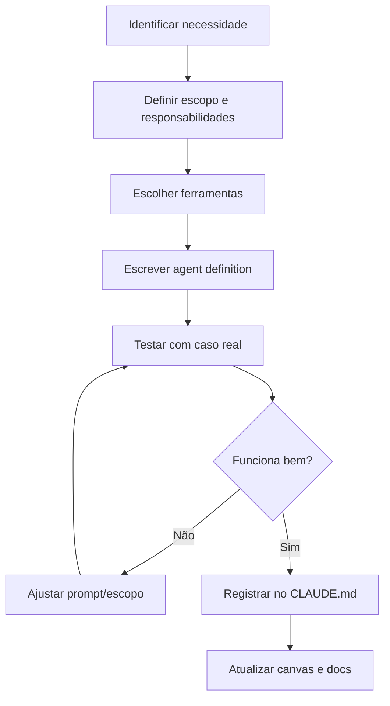

# Agent Creation Workflow

> Workflow para criar e configurar um novo agente especializado no sistema da Vault Inc.

## Quando Usar

- Quando uma nova especialidade é necessária que nenhum agente existente cobre
- Quando um agente existente está com escopo muito amplo e precisa ser dividido

## Output Esperado

- `.claude/agents/<nome>.md` — definição do agente
- Atualização do CLAUDE.md com o novo agente
- Atualização do [[agent-workflow.canvas]] com o novo nó

## Diagrama de Fluxo

## Steps

- [ ] **1. Identificar a necessidade**
  - Qual tarefa não está sendo bem atendida pelos agentes atuais?
  - Consultar lista de agentes em `.claude/agents/`

- [ ] **2. Definir escopo**
  - Responsabilidades (o que FAZ)
  - Limites (o que NÃO FAZ)
  - Interações com outros agentes (quem chama, quem é chamado)

- [ ] **3. Escolher ferramentas**
  - Quais tools o agente precisa? (Read, Write, Edit, Bash, Glob, Grep, etc.)
  - Minimizar: dar apenas o necessário

- [ ] **4. Escrever a definição usando [[agent-template]]**
  - Salvar em `.claude/agents/<nome>.md`
  - Seguir o template completo

- [ ] **5. Testar com caso real**
  - Invocar via `Agent` tool com `subagent_type`
  - Dar uma tarefa real e avaliar output

- [ ] **6. Iterar se necessário**
  - Ajustar system prompt, escopo, ou ferramentas
  - Re-testar até satisfatório

- [ ] **7. Registrar**
  - Adicionar na tabela de agentes em `.claude/agents/CLAUDE.md`
  - Adicionar no CLAUDE.md raiz do projeto
  - Atualizar [[agent-workflow.canvas]] com novo nó

## Related

- [[agent-template]] — template para definição do agente
- [[new-project-workflow]] — workflow onde agentes são usados
