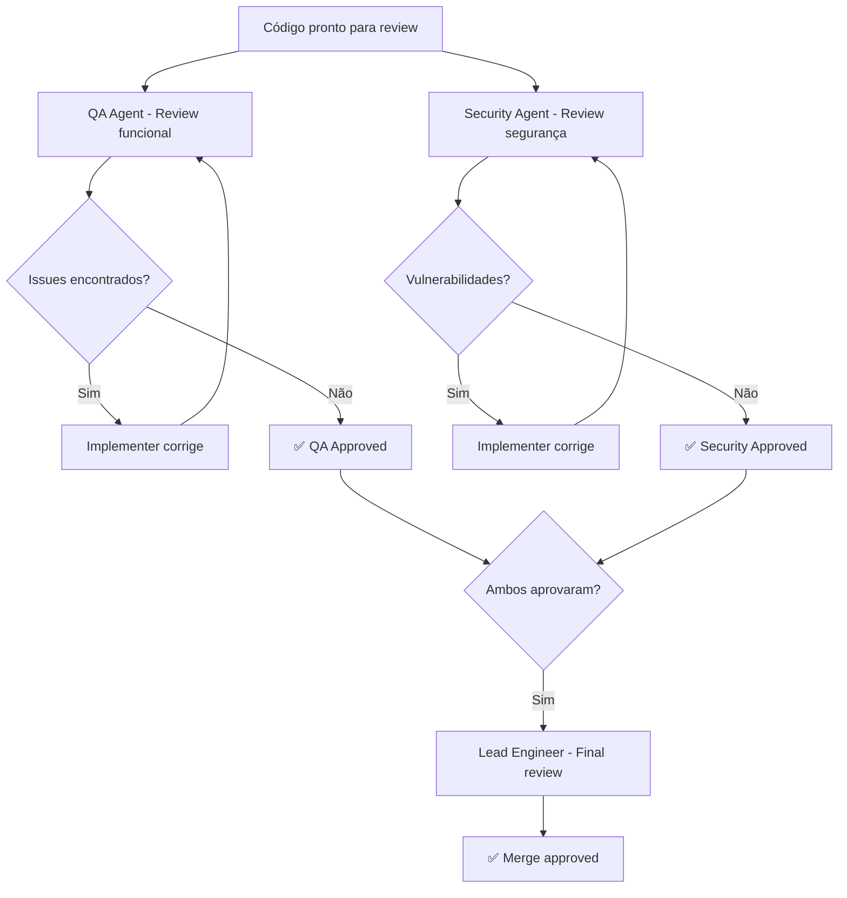

# Code Review Workflow

> Workflow para realizar code review usando agentes da Vault Inc, garantindo qualidade, segurança e consistência.

## Quando Usar

- Após implementação de features
- Antes de merge para branch principal
- Quando há código complexo que precisa de validação

## Output Esperado

- Código revisado e aprovado
- Issues encontrados documentados
- Sugestões de melhoria aplicadas

## Diagrama de Fluxo

## Steps

### Fase 1: Submission

- [ ] **1.1** Implementer marca código como pronto para review
- [ ] **1.2** Garantir que testes estão passando
- [ ] **1.3** Garantir que não há console.log / debug code

### Fase 2: Parallel Reviews

- [ ] **2.1** QA Agent revisa: funcionalidade, edge cases, test coverage
- [ ] **2.2** Security Agent revisa: OWASP Top 10, injection, auth, secrets
- [ ] **2.3** Ambos documentam findings

### Fase 3: Fix & Re-review

- [ ] **3.1** Implementer corrige issues encontrados
- [ ] **3.2** Re-submit para re-review dos items corrigidos
- [ ] **3.3** Repeat até ambos aprovarem

### Fase 4: Final Approval

- [ ] **4.1** Lead Engineer faz review final (arquitetura, padrões)
- [ ] **4.2** Se aprovado: merge
- [ ] **4.3** Se necessário ADR: criar usando [[adr-template]]

## Review Checklist — QA

- [ ] Funcionalidade atende requirements
- [ ] Edge cases cobertos
- [ ] Error handling adequado
- [ ] Test coverage > 80%
- [ ] Sem código dead/debug

## Review Checklist — Security

- [ ] Sem SQL injection
- [ ] Sem XSS
- [ ] Input validation presente
- [ ] Auth/AuthZ corretos
- [ ] Secrets não hardcoded
- [ ] Dependencies sem CVEs conhecidas

## Related

- [[new-project-workflow]] — workflow pai
- [[adr-template]] — para decisões de arquitetura durante review
