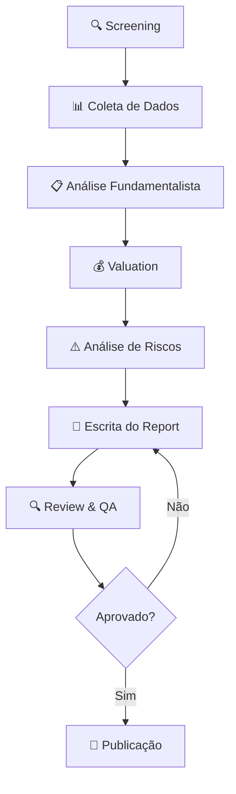

# Equity Research Workflow

> Workflow completo para realizar análise de equity research, do screening inicial ao relatório publicado.

## Quando Usar

- Quando analisar uma nova ação/empresa para investimento
- Quando atualizar uma análise existente (earnings, eventos)
- Quando o Equity Research Analyst agent é invocado

## Output Esperado

- `finance-vault/reports/equity/<TICKER>-<YYYY-MM-DD>.md` — relatório completo

## Diagrama de Fluxo

## Steps

### Fase 1: Screening & Data Collection

- [ ] **1.1** Identificar empresa/ticker para análise
- [ ] **1.2** Coletar demonstrações financeiras (últimos 5 anos): DRE, Balanço, DFC
- [ ] **1.3** Coletar dados de mercado: preço, volume, peers, setor
- [ ] **1.4** Revisar últimos earnings calls e fatos relevantes

### Fase 2: Fundamental Analysis

- [ ] **2.1** Analisar modelo de negócio e fontes de receita
- [ ] **2.2** Avaliar moat competitivo
- [ ] **2.3** Calcular key ratios: ROE, ROIC, margens, endividamento
- [ ] **2.4** Comparar ratios com peers do setor
- [ ] **2.5** Avaliar qualidade da gestão e governance

### Fase 3: Valuation

- [ ] **3.1** Executar DCF: projetar FCF, definir WACC, calcular fair value
- [ ] **3.2** Executar análise de múltiplos: P/L, EV/EBITDA, P/VP vs peers
- [ ] **3.3** Calcular preço-alvo ponderado (DCF + múltiplos)
- [ ] **3.4** Definir cenários: Bull / Base / Bear com respectivos targets

### Fase 4: Risk Assessment

- [ ] **4.1** Mapear riscos: regulatório, concorrência, macro, execução
- [ ] **4.2** Atribuir probabilidade e impacto a cada risco
- [ ] **4.3** Identificar catalisadores positivos e negativos

### Fase 5: Report Writing

- [ ] **5.1** Usar [[equity-research-template]] para estruturar o relatório
- [ ] **5.2** Preencher todas as seções com dados e análise
- [ ] **5.3** Definir rating: Buy / Hold / Sell
- [ ] **5.4** Escrever Executive Summary (por último)
- [ ] **5.5** Salvar em `finance-vault/reports/equity/<TICKER>-<YYYY-MM-DD>.md`

### Fase 6: Review & Publish

- [ ] **6.1** Revisar consistência numérica
- [ ] **6.2** Verificar se premissas de valuation são justificadas
- [ ] **6.3** Confirmar que riscos estão adequadamente cobertos
- [ ] **6.4** Publicar (mudar status para `published`)

## Templates e Referências

- [[equity-research-template]] — template do relatório

## Related

- [[investments]] — índice de investimentos
- [[new-project-workflow]] — workflow similar para projetos tech
