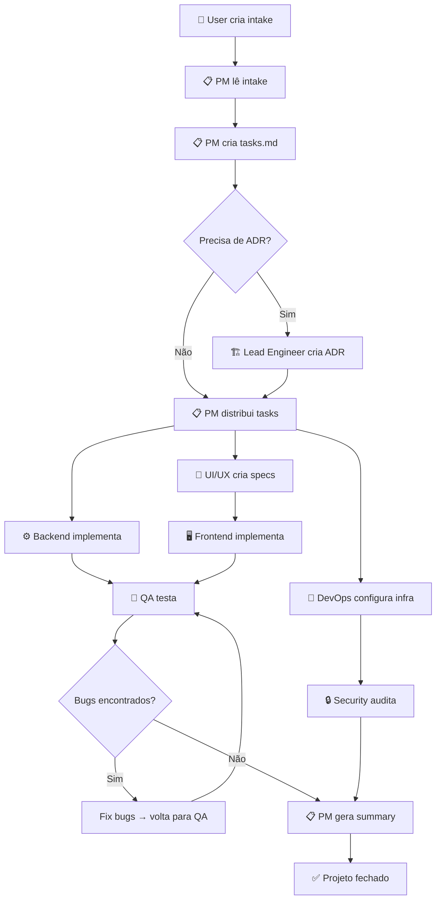

# New Project Workflow

> Workflow completo para iniciar e executar um novo projeto na Vault Inc, do intake ao closure.

## Quando Usar

- Quando um novo projeto precisa ser iniciado
- Quando há um escopo definido (mesmo que parcial) para entregar

## Output Esperado

- `vault/projects/<nome>/tasks.md` — breakdown de tarefas
- `vault/projects/<nome>/summary.md` — relatório de fechamento
- `vault/reports/qa/<nome>-<data>.md` — relatório QA
- `vault/reports/security/<nome>-<data>.md` — relatório de segurança
- Código em `projects/<nome>/`

## Diagrama de Fluxo

## Steps

### Fase 1: Intake & Planning

- [ ] **1.1** Criar arquivo de intake usando [[project-intake-template]]
- [ ] **1.2** Depositar em `vault/projects/intake/<nome>.md`
- [ ] **1.3** Instruir PM: `"PM, leia o intake em vault/projects/intake/<nome>.md e inicie o projeto"`
- [ ] **1.4** PM cria `vault/projects/<nome>/tasks.md` com breakdown
- [ ] **1.5** Lead Engineer revisa tasks e cria ADRs se necessário

### Fase 2: Design

- [ ] **2.1** UI/UX Designer cria wireframes e specs em `vault/specs/ui-ux/`
- [ ] **2.2** Lead Engineer valida specs técnicas
- [ ] **2.3** Frontend e Backend alinham contratos de API em `vault/specs/api/`

### Fase 3: Implementation

- [ ] **3.1** DevOps configura ambiente (Docker, CI/CD)
- [ ] **3.2** Backend implementa APIs e models
- [ ] **3.3** Frontend implementa interface (após specs UI/UX)
- [ ] **3.4** Data/ML Engineer implementa pipelines (se aplicável)
- [ ] **3.5** Cada agente documenta progresso no standup diário

### Fase 4: Quality & Security

- [ ] **4.1** QA cria plano de testes e executa
- [ ] **4.2** QA gera report em `vault/reports/qa/<nome>-<data>.md`
- [ ] **4.3** Security audita código e infra
- [ ] **4.4** Security gera report em `vault/reports/security/<nome>-<data>.md`
- [ ] **4.5** Bugs encontrados são corrigidos e retestados

### Fase 5: Closure

- [ ] **5.1** PM consolida resultados em `vault/projects/<nome>/summary.md`
- [ ] **5.2** Lead Engineer faz review final
- [ ] **5.3** Projeto marcado como `done`

## Templates Usados

- [[project-intake-template]] — Step 1.1
- [[adr-template]] — Step 1.5
- [[daily-standup-template]] — Step 3.5
- [[code-review-workflow]] — durante implementação

## Related

- [[agent-workflow.canvas]] — visão visual deste workflow
- [[code-review-workflow]] — sub-workflow de review
- [[equity-research-workflow]] — workflow similar para finanças
