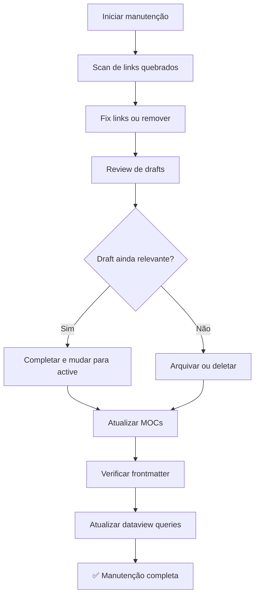

# Vault Maintenance Workflow

> Workflow periódico para manter o vault saudável, atualizado e sem links quebrados.

## Quando Usar

- Mensalmente (manutenção regular)
- Após adicionar muitos arquivos novos
- Quando o Graph View mostra nós desconectados

## Output Esperado

- Links quebrados corrigidos
- Arquivos draft revisados ou removidos
- MOCs atualizados
- Frontmatter padronizado

## Diagrama de Fluxo

## Steps

### Fase 1: Links & Integrity

- [ ] **1.1** Usar plugin "Broken Links" ou buscar `[[` sem match
- [ ] **1.2** Corrigir links quebrados (typo, arquivo renomeado)
- [ ] **1.3** Remover links para arquivos que não existem mais
- [ ] **1.4** Verificar se todos os arquivos têm pelo menos 1 wikilink

### Fase 2: Content Review

- [ ] **2.1** Listar todos os arquivos com `status: draft`
- [ ] **2.2** Para cada draft: completar (→ active) ou arquivar (→ archived)
- [ ] **2.3** Verificar arquivos com `updated` > 90 dias — ainda atuais?
- [ ] **2.4** Atualizar conteúdo desatualizado (versões, links externos)

### Fase 3: Structure

- [ ] **3.1** Atualizar cada MOC com novos arquivos adicionados
- [ ] **3.2** Verificar que dataview queries retornam resultados corretos
- [ ] **3.3** Padronizar frontmatter (todos os campos obrigatórios presentes)
- [ ] **3.4** Verificar consistência de tags (sem duplicatas como "ai" vs "AI")

### Fase 4: Cross-Vault

- [ ] **4.1** Verificar links entre vaults (tech↔finance↔claude)
- [ ] **4.2** Adicionar links cruzados para novos arquivos que se relacionam
- [ ] **4.3** Atualizar Graph View e verificar clusters desconectados

## Related

- [[🗺️ Docs-Home]] — índice de todos os templates
- [[moc-template]] — para criar MOCs faltantes
