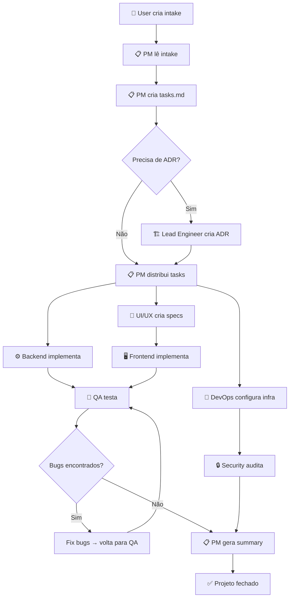
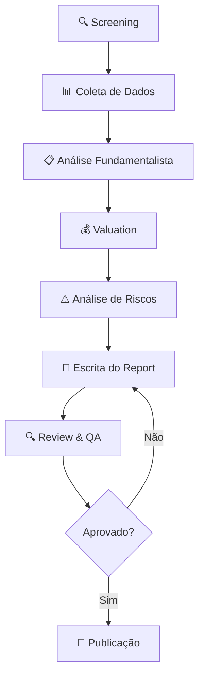
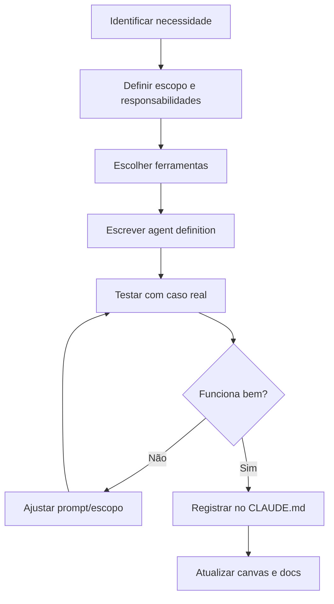
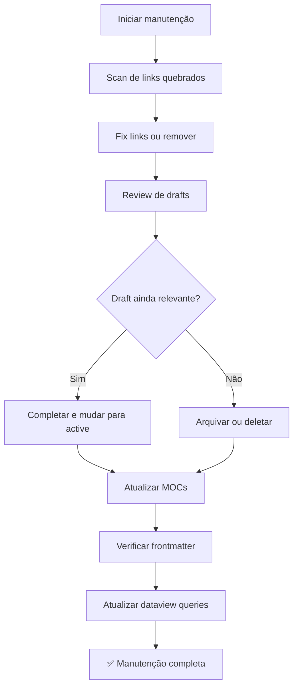
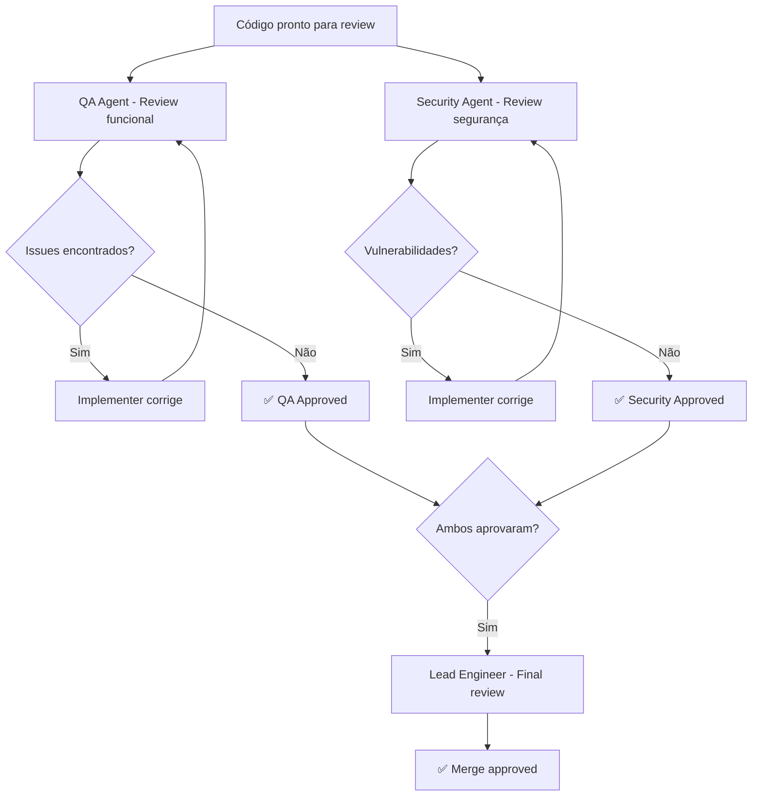

# Vault Inc Library Expansion — Implementation Plan

> **For agentic workers:** REQUIRED SUB-SKILL: Use superpowers:subagent-driven-development (recommended) or superpowers:executing-plans to implement this plan task-by-task. Steps use checkbox (`- [ ]`) syntax for tracking.

**Goal:** Expandir a Vault-Inc-Library com ~73 novos arquivos em 4 camadas: docs (templates/canvas/workflows), claude-vault core, claude-vault completo, e integração entre vaults.

**Architecture:** Abordagem layered — cada camada constrói sobre a anterior. Camada 1 (docs) estabelece templates que padronizam a criação de conteúdo nas camadas seguintes. Camada 2-3 (claude-vault) usa esses templates. Camada 4 (integração) conecta tudo com wikilinks e arquivos-ponte.

**Tech Stack:** Obsidian Markdown, YAML frontmatter, Mermaid diagrams, Dataview queries, Obsidian Canvas JSON format

**Spec:** `docs/superpowers/specs/2026-04-10-vault-library-expansion-design.md`

---

## Nota sobre Templates

O `tech-vault/08-templates/` contém templates com Templater (plugin Obsidian, sintaxe `<%* %>`), feitos para uso interativo dentro do Obsidian. Os templates em `docs/01-templates/` são **plain markdown com `{{placeholder}}`**, feitos para consumo por humanos e agentes de IA. São complementares, não duplicados.

---

## CAMADA 1 — FUNDAÇÃO (docs/)

### Task 1: Criar estrutura de diretórios do docs

**Files:**
- Create: `docs/00-moc/` (diretório)
- Create: `docs/01-templates/` (diretório)
- Create: `docs/02-canvas/` (diretório)
- Create: `docs/03-workflows/` (diretório)

- [ ] **Step 1: Criar os diretórios**

```bash
mkdir -p docs/00-moc docs/01-templates docs/02-canvas docs/03-workflows
```

- [ ] **Step 2: Verificar estrutura**

```bash
ls -la docs/
```

Expected: 00-moc, 01-templates, 02-canvas, 03-workflows, superpowers

---

### Task 2: Criar MOC do Docs (🗺️ Docs-Home.md)

**Files:**
- Create: `docs/00-moc/🗺️ Docs-Home.md`

- [ ] **Step 1: Criar o arquivo MOC**

```markdown
---
tags: [moc, home, docs]
status: active
complexity: basic
context: global
updated: 2026-04-10
created: 2026-04-10
aliases: [Docs Home, Templates Home]
---

# 🗺️ Docs — Central de Templates & Workflows

## Visão Geral

Este vault é o repositório central de templates, canvas e workflows da Vault Inc. Todos os artefatos padronizados da empresa vivem aqui — desde templates de notas simples até workflows completos de projetos multi-agente.

> [!info] Como Navegar
> Use as seções abaixo como ponto de entrada. Templates são plain markdown com placeholders `{{variavel}}` para fácil substituição — tanto por humanos quanto por agentes de IA.

> [!tip] Templater vs Plain Markdown
> Os templates aqui são **plain markdown** (para agentes e uso manual). Para templates interativos no Obsidian com prompts automáticos, veja `tech-vault/08-templates/` que usa o plugin Templater.

---

## 📋 Templates

| Template | Propósito | Consumido por |
|----------|-----------|---------------|
| [[note-template]] | Base para qualquer nota nova | Humanos |
| [[moc-template]] | Criar novos Maps of Content | Humanos |
| [[skill-template]] | Criar skills do Claude Code | Humanos + Agentes |
| [[agent-template]] | Definir novos agentes | Humanos + Agentes |
| [[adr-template]] | Architecture Decision Records | Lead Engineer |
| [[project-intake-template]] | Intake de novo projeto | PM agent |
| [[equity-research-template]] | Relatório de equity research | Financial Research agents |
| [[meeting-notes-template]] | Atas de reunião | Humanos |
| [[weekly-review-template]] | Review semanal | Humanos + PM |
| [[daily-standup-template]] | Standup diário | Agentes |

---

## 🎨 Canvas

| Canvas | Propósito |
|--------|-----------|
| [[project-kickoff.canvas\|Project Kickoff]] | Visão geral de novo projeto |
| [[brainstorm-board.canvas\|Brainstorm Board]] | Board para brainstorming |
| [[tech-architecture.canvas\|Tech Architecture]] | Diagramas de arquitetura |
| [[pitchbook-layout.canvas\|Pitchbook Layout]] | Layout para pitchbooks financeiros |
| [[agent-workflow.canvas\|Agent Workflow]] | Fluxo visual dos agentes |

---

## 🔄 Workflows

| Workflow | Propósito |
|----------|-----------|
| [[new-project-workflow]] | Intake → PM → Agentes → Entrega → Closure |
| [[equity-research-workflow]] | Screening → Fundamentals → Valuation → Report |
| [[agent-creation-workflow]] | Criar e configurar novo agente |
| [[vault-maintenance-workflow]] | Manutenção periódica do vault |
| [[code-review-workflow]] | Review com agentes: implementer → reviewer |

---

## 📊 Dashboard — Atualizações Recentes

```dataview
TABLE status, updated
FROM "docs"
WHERE file.name != "🗺️ Docs-Home"
SORT updated DESC
LIMIT 15
```

---

## 🔗 Relacionados

- [[🗺️ Home]] — Finance Vault Home
- [[🗺️ Claude-Home]] — Claude Vault Home (quando criado)
- `tech-vault/08-templates/` — Templates com Templater (interativos no Obsidian)
```

- [ ] **Step 2: Verificar renderização do frontmatter e links**

Abrir no Obsidian e confirmar que o YAML é válido e os links aparecem no Graph View.

---

### Task 3: Criar templates base (note-template e moc-template)

**Files:**
- Create: `docs/01-templates/note-template.md`
- Create: `docs/01-templates/moc-template.md`

- [ ] **Step 1: Criar note-template.md**

```markdown
---
tags: [template, docs]
status: active
type: template
updated: 2026-04-10
created: 2026-04-10
aliases: [Note Template]
---

# Note Template

> [!template] Como Usar
> Este é o template base para criar qualquer nota nova no vault. Copie o conteúdo abaixo, substitua os placeholders `{{...}}` e remova as instruções em comentários HTML.

---

## Template

```yaml
---
tags: [{{tag-principal}}, {{tag-secundaria}}]
status: draft
level: {{basic | intermediate | advanced}}
updated: {{YYYY-MM-DD}}
created: {{YYYY-MM-DD}}
aliases: [{{Alias 1}}, {{Alias 2}}]
---
```

```markdown
# {{Título da Nota}}

> {{Resumo em uma frase do conteúdo desta nota.}}

## Overview

<!-- Descreva o tema: o que é, por que importa, contexto geral.
     Responda: Qual problema isso resolve? Quem se beneficia? -->

## Core Concepts

<!-- Liste os 3-7 conceitos fundamentais que o leitor precisa entender.
     Use sub-headings para cada conceito. Linke para notas relacionadas. -->

### {{Conceito 1}}

### {{Conceito 2}}

### {{Conceito 3}}

## Practical Application

<!-- Como aplicar este conhecimento na prática.
     Inclua exemplos concretos, code snippets, ou passo a passo. -->

## Gotchas

> [!warning] Armadilhas Comuns
> - {{Gotcha 1}}: descrição
> - {{Gotcha 2}}: descrição

## Snippets

<!-- Blocos de código ou texto prontos para copiar e usar. -->

## References

- [{{Fonte 1}}]({{url}})
- [{{Fonte 2}}]({{url}})

## Related

- [[{{nota-relacionada-1}}]]
- [[{{nota-relacionada-2}}]]
```

---

## Campos do Frontmatter

| Campo | Obrigatório | Valores | Descrição |
|-------|-------------|---------|-----------|
| tags | Sim | array de strings | Categorias da nota |
| status | Sim | draft, active, review, archived | Estado atual |
| level | Sim | basic, intermediate, advanced | Complexidade do conteúdo |
| updated | Sim | YYYY-MM-DD | Última atualização |
| created | Sim | YYYY-MM-DD | Data de criação |
| aliases | Não | array de strings | Nomes alternativos para busca |

## Related

- [[moc-template]] — template para Maps of Content
- [[skill-template]] — template para skills do Claude Code
```

- [ ] **Step 2: Criar moc-template.md**

```markdown
---
tags: [template, docs, moc]
status: active
type: template
updated: 2026-04-10
created: 2026-04-10
aliases: [MOC Template, Map of Content Template]
---

# MOC Template

> [!template] Como Usar
> Use este template ao criar um novo Map of Content (MOC). MOCs são índices temáticos que agrupam e organizam notas relacionadas. Cada vault/seção principal deve ter seu MOC.

---

## Template

```yaml
---
tags: [moc, {{dominio}}]
status: active
complexity: basic
context: global
updated: {{YYYY-MM-DD}}
created: {{YYYY-MM-DD}}
aliases: [{{Nome do MOC}}, {{Alias}}]
---
```

```markdown
# 🗺️ {{Nome do Domínio}} MOC

## Visão Geral

{{Descrição do domínio coberto por este MOC. O que o leitor encontra aqui?
Qual é o escopo e o propósito desta coleção de notas?}}

> [!info] Cobertura
> Esta seção (`{{path/}}`) contém {{N}} arquivos organizados em {{categorias}}.

---

## 📊 Dashboard

\```dataview
TABLE status, level, updated
FROM "{{path-do-vault/secao}}"
WHERE file.name != "🗺️ {{Nome}}"
SORT updated DESC
\```

---

## 🗺️ Skills Map

### {{Categoria 1}}

| Arquivo | Conteúdo | Status |
|---------|---------|--------|
| [[{{arquivo-1}}]] | {{descrição}} | ✅ active |
| [[{{arquivo-2}}]] | {{descrição}} | 🚧 draft |

### {{Categoria 2}}

| Arquivo | Conteúdo | Status |
|---------|---------|--------|
| [[{{arquivo-3}}]] | {{descrição}} | ✅ active |

---

## ⚡ Quick Access

- [[{{nota-essencial-1}}]] — {{por que é essencial}}
- [[{{nota-essencial-2}}]] — {{por que é essencial}}
- [[{{nota-essencial-3}}]] — {{por que é essencial}}

---

## 🔗 Conexões com Outros Vaults

- **{{Vault 1}}** → [[{{moc-relacionado}}]] — {{relação}}
- **{{Vault 2}}** → [[{{moc-relacionado}}]] — {{relação}}
```

---

## Boas Práticas para MOCs

1. **Mantenha atualizado** — adicione novas notas ao MOC quando criá-las
2. **Use dataview** — queries automáticas evitam MOCs desatualizados
3. **Link bidirecional** — cada nota listada no MOC deve linkar de volta ao MOC
4. **Seção Quick Access** — as 3-5 notas mais consultadas em destaque
5. **Conexões entre vaults** — sempre incluir links para MOCs de outros domínios

## Related

- [[note-template]] — template base para notas
- [[🗺️ Docs-Home]] — MOC principal do docs
```

---

### Task 4: Criar templates para agentes e skills

**Files:**
- Create: `docs/01-templates/skill-template.md`
- Create: `docs/01-templates/agent-template.md`

- [ ] **Step 1: Criar skill-template.md**

```markdown
---
tags: [template, docs, claude-code, skill]
status: active
type: template
updated: 2026-04-10
created: 2026-04-10
aliases: [Skill Template, Claude Skill Template]
---

# Skill Template — Claude Code

> [!template] Como Usar
> Use este template para criar novas skills do Claude Code. Skills são arquivos Markdown com frontmatter especial que definem comportamentos acionados por comandos `/skill-name`. Salve o resultado em `.claude/skills/` (global) ou `.claude/skills/` do projeto.

> [!tip] Templater Version
> Para criar skills diretamente no Obsidian com prompts interativos, use o template Templater em `tech-vault/08-templates/skill-template.md`.

---

## Template — Skill Rígida (Checklist Obrigatório)

```yaml
---
name: {{nome-da-skill}}
description: {{Descrição em uma linha — usada para matching}}
---
```

```markdown
# {{Nome da Skill}}

## Instruções

{{Descreva o que a skill faz, quando deve ser usada, e qual é o objetivo final.
Seja específico — o agente seguirá estas instruções literalmente.}}

## Checklist Obrigatório

- [ ] {{Step 1}}: {{descrição do que verificar/fazer}}
- [ ] {{Step 2}}: {{descrição do que verificar/fazer}}
- [ ] {{Step 3}}: {{descrição do que verificar/fazer}}
- [ ] {{Step 4}}: {{descrição do que verificar/fazer}}
- [ ] {{Step 5}}: {{descrição do que verificar/fazer}}

## Formato do Output

\```
{{formato esperado do output — exemplo concreto}}
\```

## Exemplos

### Input
{{exemplo de input/trigger}}

### Output Esperado
{{exemplo de output correto}}

## Gotchas

> [!warning] Cuidados
> - {{Gotcha 1}}
> - {{Gotcha 2}}
```

---

## Template — Skill Flexível (Fluxo Adaptativo)

```yaml
---
name: {{nome-da-skill}}
description: {{Descrição em uma linha}}
---
```

```markdown
# {{Nome da Skill}}

## Contexto

{{Quando esta skill deve ser invocada. Quais sinais indicam que ela é relevante.}}

## Processo

### Fase 1: {{Nome}}
{{Instruções para a primeira fase. O agente decide a ordem baseado no contexto.}}

### Fase 2: {{Nome}}
{{Instruções para a segunda fase.}}

### Fase 3: {{Nome}}
{{Instruções para a terceira fase.}}

## Princípios

- {{Princípio 1}} — {{por que importa}}
- {{Princípio 2}} — {{por que importa}}
- {{Princípio 3}} — {{por que importa}}

## Output Esperado

{{Descrição do que a skill deve produzir ao final.}}
```

---

## Campos do Frontmatter de Skills

| Campo | Obrigatório | Descrição |
|-------|-------------|-----------|
| name | Sim | Identificador único da skill |
| description | Sim | Linha usada para matching — seja específico |

## Onde Salvar Skills

| Local | Escopo | Prioridade |
|-------|--------|------------|
| `~/.claude/skills/` | Global (todas as sessões) | Normal |
| `.claude/skills/` (projeto) | Apenas este projeto | Alta (sobrescreve global) |

## Dicas para Skills Eficazes

1. **Seja específico no description** — é o campo que o Claude usa para decidir se a skill se aplica
2. **Rigid para processos** — use checklist quando a ordem importa (deploy, review, TDD)
3. **Flexible para criatividade** — use fases quando o agente precisa adaptar (brainstorming, design)
4. **Teste antes de deployar** — invoque a skill com `/skill-name` e veja se o comportamento é o esperado
5. **Mantenha curto** — skills longas (>200 linhas) consomem contexto; divida em sub-skills

## Related

- [[agent-template]] — template para definir agentes
- [[skills-system]] — guia completo do sistema de skills (claude-vault)
- [[hook-snippets]] — snippets de hooks que complementam skills
```

- [ ] **Step 2: Criar agent-template.md**

```markdown
---
tags: [template, docs, claude-code, agent]
status: active
type: template
updated: 2026-04-10
created: 2026-04-10
aliases: [Agent Template, Claude Agent Template]
---

# Agent Template — Claude Code

> [!template] Como Usar
> Use este template para definir novos agentes especializados no sistema da Vault Inc. Agentes são definidos em `.claude/agents/` e invocados via `Agent` tool com `subagent_type`. Cada agente tem escopo, responsabilidades e ferramentas específicas.

---

## Template

```markdown
# {{Nome do Agente}}

## Identidade

Você é o **{{Nome do Cargo}}** da Vault Inc. {{Descrição em 2-3 frases do papel, expertise e perspectiva única que este agente traz.}}

## Responsabilidades

- {{Responsabilidade 1}} — {{contexto de quando se aplica}}
- {{Responsabilidade 2}}
- {{Responsabilidade 3}}
- {{Responsabilidade 4}}

## Ferramentas Disponíveis

| Ferramenta | Uso |
|------------|-----|
| Read | {{quando usar}} |
| Write | {{quando usar}} |
| Edit | {{quando usar}} |
| Bash | {{quando usar}} |
| Glob | {{quando usar}} |
| Grep | {{quando usar}} |

## Escopo

### Dentro do Escopo
- {{O que este agente FAZ}}
- {{O que este agente FAZ}}

### Fora do Escopo
- {{O que este agente NÃO FAZ}} → escalar para {{outro agente}}
- {{O que este agente NÃO FAZ}} → escalar para {{outro agente}}

## Padrões de Output

### {{Tipo de Artefato 1}}
- Local: `{{path/to/output/}}`
- Formato: {{formato esperado}}
- Naming: `{{padrao-de-nome}}`

### {{Tipo de Artefato 2}}
- Local: `{{path/to/output/}}`
- Formato: {{formato esperado}}

## Workflow

\```
{{Diagrama ASCII do fluxo de trabalho do agente}}
Input → Análise → {{Step}} → {{Step}} → Output
\```

## Regras

1. {{Regra inviolável 1}}
2. {{Regra inviolável 2}}
3. Documentar trabalho no standup diário (`vault/standups/`)
4. Conflitos de escopo → escalar para Lead Engineer
5. Nunca escrever fora do seu escopo sem aprovação

## Contexto — Knowledge Base

Para executar suas tarefas, consulte:
- {{vault/path}} — {{o que encontra lá}}
- {{vault/path}} — {{o que encontra lá}}

## Exemplos de Invocação

### Exemplo 1: {{Caso de uso}}
\```
{{Comando ou instrução que invoca este agente}}
\```

### Exemplo 2: {{Caso de uso}}
\```
{{Comando ou instrução}}
\```
```

---

## Agentes Existentes na Vault Inc

| Agente | Arquivo | subagent_type |
|--------|---------|---------------|
| PM | `.claude/agents/pm.md` | pm |
| Lead Engineer | `.claude/agents/lead-engineer.md` | lead-engineer |
| UI/UX Designer | `.claude/agents/ui-ux.md` | ui-ux-designer |
| Frontend | `.claude/agents/frontend.md` | frontend-engineer |
| Backend | `.claude/agents/backend.md` | backend-engineer |
| DevOps | `.claude/agents/devops.md` | devops-engineer |
| QA | `.claude/agents/qa.md` | qa-engineer |
| Security | `.claude/agents/security.md` | security-engineer |
| Data Engineer | `.claude/agents/data-engineer.md` | data-engineer |
| ML Engineer | `.claude/agents/ml-engineer.md` | ml-engineer |

## Related

- [[skill-template]] — template para skills
- [[agent-teams]] — guia de orquestração multi-agente (claude-vault)
- [[new-project-workflow]] — workflow que usa os agentes
```

---

### Task 5: Criar templates operacionais (ADR, project-intake, equity-research)

**Files:**
- Create: `docs/01-templates/adr-template.md`
- Create: `docs/01-templates/project-intake-template.md`
- Create: `docs/01-templates/equity-research-template.md`

- [ ] **Step 1: Criar adr-template.md**

```markdown
---
tags: [template, docs, architecture]
status: active
type: template
updated: 2026-04-10
created: 2026-04-10
aliases: [ADR Template, Architecture Decision Record Template]
---

# ADR Template — Architecture Decision Record

> [!template] Como Usar
> Use este template para documentar decisões arquiteturais significativas. Toda decisão que afeta a estrutura do sistema, escolha de tecnologia, ou trade-off importante deve ser registrada como ADR. O Lead Engineer agent usa este template automaticamente.

> [!tip] Templater Version
> Para criar ADRs diretamente no Obsidian com prompts interativos, use `tech-vault/08-templates/adr-template.md`.

---

## Template

```yaml
---
tags: [adr, architecture]
adr_number: {{NNNN}}
status: {{proposed | accepted | deprecated | superseded}}
created: {{YYYY-MM-DD}}
updated: {{YYYY-MM-DD}}
---
```

```markdown
# ADR-{{NNNN}}: {{Título da Decisão}}

**Date:** {{YYYY-MM-DD}}
**Status:** {{proposed | accepted | deprecated | superseded}}
**Deciders:** {{quem participou da decisão}}

---

## Context

### Problem Statement
{{Descreva o problema ou necessidade que exige uma decisão arquitetural.}}

### Forces & Constraints
- **Technical:** {{restrição técnica}}
- **Business:** {{restrição de negócio}}
- **Time:** {{restrição de prazo}}
- **Team:** {{restrição de equipe/skills}}

### Options Considered

| Option | Summary | Pros | Cons |
|--------|---------|------|------|
| A — {{nome}} | {{resumo}} | {{prós}} | {{contras}} |
| B — {{nome}} | {{resumo}} | {{prós}} | {{contras}} |
| C — {{nome}} ✅ | {{resumo}} | {{prós}} | {{contras}} |

---

## Decision

**We will** {{declaração da decisão em uma frase}}.

**Rationale:**
- {{Razão 1 — por que esta opção foi escolhida}}
- {{Razão 2}}
- {{Razão 3}}

---

## Consequences

### Positive
- {{Benefício direto 1}}
- {{Benefício direto 2}}

### Negative
- {{Trade-off ou risco 1}}
- {{Trade-off ou risco 2}}

### Neutral
- {{Mudança notável mas neutra}}

---

## Implementation Notes

- [ ] {{Step de implementação 1}}
- [ ] {{Step de implementação 2}}
- [ ] {{Step de implementação 3}}

---

## Related Decisions

- [[adr-{{NNNN}}]] — {{relação: builds on / supersedes / related to}}

## References

- {{Links para docs, RFCs, artigos que informaram a decisão}}
```

---

## Quando Criar um ADR

- Escolha de linguagem, framework, ou banco de dados
- Mudança de arquitetura (monolito → microservices, etc.)
- Adoção ou remoção de dependência significativa
- Trade-off de segurança, performance, ou custo
- Qualquer decisão que alguém perguntaria "por que fizeram assim?"

## Lifecycle

```
proposed → accepted → [deprecated | superseded]
```

- **proposed** — em discussão, ainda não decidido
- **accepted** — decisão tomada, em vigor
- **deprecated** — não mais relevante (tecnologia removida)
- **superseded** — substituído por ADR mais recente (linkar)

## Related

- [[project-intake-template]] — intake que pode gerar ADRs
- [[new-project-workflow]] — workflow onde ADRs são criados
```

- [ ] **Step 2: Criar project-intake-template.md**

```markdown
---
tags: [template, docs, project-management]
status: active
type: template
updated: 2026-04-10
created: 2026-04-10
aliases: [Project Intake Template, Intake Template]
---

# Project Intake Template

> [!template] Como Usar
> Use este template para iniciar qualquer novo projeto na Vault Inc. Preencha o máximo de campos possível e deposite em `vault/projects/intake/`. O PM agent lê o intake e cria o breakdown de tarefas.

> [!info] Template Original
> Versão estendida do template em `.claude/agents/PROJECT_INTAKE_TEMPLATE.md`. Esta versão inclui instruções e exemplos para cada seção.

---

## Template

```markdown
# Project Intake — {{Nome do Projeto}}

> Deposite em `vault/projects/intake/` e instrua o PM:
> "PM, leia o intake em vault/projects/intake/{{nome}}.md e inicie o projeto"

---

## 1. Visão Geral

**Nome do projeto:** {{nome}}
**Data de criação:** {{YYYY-MM-DD}}
**Solicitante:** {{quem pediu o projeto}}

**Descrição em uma frase:**
> {{Ex: "Uma plataforma web para gestão de contratos com assinatura digital."}}

**Problema que resolve:**
> {{Qual dor ou oportunidade este projeto endereça?}}

---

## 2. Objetivos

**O que é sucesso para este projeto?**
- {{Critério de sucesso mensurável 1}}
- {{Critério de sucesso mensurável 2}}

**O que está fora do escopo (explicitamente)?**
- {{Exclusão 1}}
- {{Exclusão 2}}

---

## 3. Usuários e Personas

| Persona | Perfil | Necessidade Principal |
|---------|--------|----------------------|
| {{Persona 1}} | {{descrição}} | {{necessidade}} |
| {{Persona 2}} | {{descrição}} | {{necessidade}} |

---

## 4. Funcionalidades

### Must Have (obrigatório para MVP)
- [ ] {{Feature 1}} — {{descrição}}
- [ ] {{Feature 2}} — {{descrição}}

### Should Have (importante, mas não bloqueante)
- [ ] {{Feature 3}} — {{descrição}}

### Nice to Have (futuro)
- [ ] {{Feature 4}} — {{descrição}}

---

## 5. Stack e Tecnologias

> Deixe em branco para o Lead Engineer decidir.

| Layer | Tecnologia | Notas |
|-------|-----------|-------|
| Frontend | {{ou vazio}} | |
| Backend | {{ou vazio}} | |
| Database | {{ou vazio}} | |
| Auth | {{ou vazio}} | |
| Infra | {{ou vazio}} | |
| Integrações | {{APIs externas}} | |

---

## 6. Dados e IA

**Envolve dados?** {{sim/não}}
- Fontes: {{de onde vêm os dados}}
- Volume: {{estimativa}}

**Envolve ML/IA?** {{sim/não}}
- Tipo: {{classificação / geração / recomendação / RAG / outro}}
- Dados para treino: {{disponibilidade}}

---

## 7. Segurança e Compliance

**Dados sensíveis:** {{PII, financeiros, saúde?}}
**Regulamentações:** {{LGPD, GDPR, PCI-DSS, HIPAA?}}
**Criticidade:** {{Baixo | Médio | Alto | Crítico}}

---

## 8. Restrições

**Prazo:** {{data ou "sem prazo definido"}}
**Budget:** {{se aplicável}}
**Dependências:** {{sistemas existentes, APIs, equipes}}

---

## 9. Referências

- {{Link para inspiração/produto similar}}
- {{Link para documento relacionado}}
- {{Link para design/Figma}}

---

## 10. Notas Adicionais

> {{Contexto extra para o PM e agentes.}}
```

## Related

- [[new-project-workflow]] — workflow completo após intake
- [[agent-template]] — como os agentes são configurados
- [[🗺️ Docs-Home]] — índice de templates
```

- [ ] **Step 3: Criar equity-research-template.md**

```markdown
---
tags: [template, docs, finance, equity-research]
status: active
type: template
updated: 2026-04-10
created: 2026-04-10
aliases: [Equity Research Template, Stock Analysis Template]
---

# Equity Research Template

> [!template] Como Usar
> Use este template para gerar relatórios de equity research na Vault Inc. O Equity Research Analyst agent (`finance-vault/agents/financial-research-house/equity-research-analyst.md`) usa este template para produzir análises padronizadas. Também pode ser usado manualmente para análises pessoais.

> [!info] Template Simples
> Para uma análise rápida sem o nível de detalhe de um research report, veja `finance-vault/11-templates/stock-analysis-template.md`.

---

## Template

```yaml
---
tags: [equity-research, {{setor}}, {{ticker}}]
status: {{draft | published | outdated}}
ticker: {{TICKER}}
company: {{Nome da Empresa}}
sector: {{setor}}
market: {{B3 | NYSE | NASDAQ}}
rating: {{Buy | Hold | Sell | Under Review}}
target_price: {{R$ XX,XX ou $XX.XX}}
current_price: {{preço no momento da análise}}
upside: {{+XX% ou -XX%}}
analyst: {{nome ou "AI-Generated"}}
created: {{YYYY-MM-DD}}
updated: {{YYYY-MM-DD}}
---
```

```markdown
# {{TICKER}} — {{Nome da Empresa}}

> **Rating:** {{Buy/Hold/Sell}} | **Target:** {{preço-alvo}} | **Upside:** {{%}} | **Data:** {{YYYY-MM-DD}}

---

## Executive Summary

{{Resumo executivo em 3-5 frases: o que a empresa faz, tese principal de investimento, e a recomendação com justificativa.}}

---

## 1. Company Overview

### Descrição do Negócio
{{O que a empresa faz, modelo de receita, mercado de atuação.}}

### Competitive Moat
{{Vantagens competitivas sustentáveis. Referência: [[warren-buffett-framework]]}}

| Tipo de Moat | Presente? | Evidência |
|-------------|-----------|-----------|
| Brand | {{sim/não}} | {{evidência}} |
| Network Effects | {{sim/não}} | {{evidência}} |
| Switching Costs | {{sim/não}} | {{evidência}} |
| Cost Advantage | {{sim/não}} | {{evidência}} |
| Intangible Assets | {{sim/não}} | {{evidência}} |

### Management Quality
{{Qualidade da gestão, histórico, alinhamento com acionistas.}}

---

## 2. Financial Analysis

### Income Statement (últimos 5 anos)

| Métrica | {{Y-4}} | {{Y-3}} | {{Y-2}} | {{Y-1}} | {{Y0}} |
|---------|---------|---------|---------|---------|--------|
| Receita Líquida | | | | | |
| EBITDA | | | | | |
| Lucro Líquido | | | | | |
| Margem Bruta | | | | | |
| Margem EBITDA | | | | | |
| Margem Líquida | | | | | |

### Key Ratios

| Ratio | Valor | Setor Avg | Avaliação |
|-------|-------|-----------|-----------|
| P/L | | | {{barato/justo/caro}} |
| EV/EBITDA | | | |
| P/VP | | | |
| ROE | | | |
| ROIC | | | |
| Dividend Yield | | | |
| Dívida Líq./EBITDA | | | |

Referência: [[key-ratios]], [[valuation-multiples]]

### Cash Flow

{{Análise do fluxo de caixa: geração operacional, capex, FCF. Referência: [[cash-flow-statement]]}}

### Balance Sheet Health

{{Endividamento, liquidez, qualidade dos ativos. Referência: [[balance-sheet]]}}

---

## 3. Valuation

### DCF — Discounted Cash Flow

| Premissa | Valor | Justificativa |
|----------|-------|---------------|
| WACC | {} | {{base}} |
| Terminal Growth | {{%}} | {{base}} |
| FCF Base | {{valor}} | {{último FCF normalizado}} |

**Fair Value (DCF):** {{R$ XX,XX}}

Referência: [[valuation-dcf]]

### Múltiplos — Análise Relativa

| Peer | P/L | EV/EBITDA | P/VP |
|------|-----|-----------|------|
| {{Peer 1}} | | | |
| {{Peer 2}} | | | |
| {{Peer 3}} | | | |
| **{{TICKER}}** | | | |

**Fair Value (Múltiplos):** {{R$ XX,XX}}

Referência: [[valuation-multiples]]

### Price Target Summary

| Método | Fair Value | Peso |
|--------|-----------|------|
| DCF | {{valor}} | {} |
| **Weighted Target** | **{{valor}}** | **100%** |

---

## 4. Risks

| Risco | Probabilidade | Impacto | Mitigação |
|-------|--------------|---------|-----------|
| {{Risco 1}} | {{Alta/Média/Baixa}} | {{Alto/Médio/Baixo}} | {{como mitigar}} |
| {{Risco 2}} | | | |
| {{Risco 3}} | | | |

---

## 5. Investment Thesis

### Bull Case ({{target otimista}})
{{Cenário otimista — o que precisa dar certo.}}

### Base Case ({{target base}})
{{Cenário base — expectativa realista.}}

### Bear Case ({{target pessimista}})
{{Cenário pessimista — o que pode dar errado.}}

---

## 6. Catalysts & Timeline

| Catalyst | Expectativa | Horizonte |
|----------|-------------|-----------|
| {{Catalisador 1}} | {{impacto esperado}} | {{quando}} |
| {{Catalisador 2}} | | |

---

## Disclaimer

> [!warning] Aviso
> Este relatório é para fins educacionais e de pesquisa. Não constitui recomendação de investimento. Faça sua própria análise antes de investir.

## References

- {{Fonte de dados: RI da empresa, CVM, Bloomberg}}
- [[investment-checklist]] — checklist antes de investir
- [[stock-analysis-template]] — versão simplificada

## Related

- [[🗺️ Investments-MOC]]
- [[growth-vs-value]]
- [[graham-net-net]]
```

## Related

- [[stock-analysis-template]] — finance-vault, versão simplificada
- [[equity-research-workflow]] — workflow completo de pesquisa
- [[financial-analysis-with-claude]] — usando IA para pesquisa (claude-vault)
```

---

### Task 6: Criar templates de rotina (meeting, weekly-review, daily-standup)

**Files:**
- Create: `docs/01-templates/meeting-notes-template.md`
- Create: `docs/01-templates/weekly-review-template.md`
- Create: `docs/01-templates/daily-standup-template.md`

- [ ] **Step 1: Criar meeting-notes-template.md**

```markdown
---
tags: [template, docs, meetings]
status: active
type: template
updated: 2026-04-10
created: 2026-04-10
aliases: [Meeting Notes Template, Ata de Reunião Template]
---

# Meeting Notes Template

> [!template] Como Usar
> Use este template para registrar qualquer reunião, call ou sync. Preencha durante ou imediatamente após a reunião. Action items com checkboxes aparecem automaticamente nos dashboards do Obsidian Tasks.

---

## Template

```yaml
---
tags: [meeting, {{tipo: sync | planning | review | 1on1 | client}}]
status: {{active | archived}}
date: {{YYYY-MM-DD}}
participants: [{{nome1}}, {{nome2}}]
project: {{nome-do-projeto ou "general"}}
created: {{YYYY-MM-DD}}
---
```

```markdown
# {{Título da Reunião}} — {{YYYY-MM-DD}}

**Tipo:** {{Sync | Planning | Review | 1:1 | Client Call}}
**Duração:** {{HH:MM - HH:MM}}
**Participantes:** {{lista}}

---

## Agenda

1. {{Tópico 1}}
2. {{Tópico 2}}
3. {{Tópico 3}}

---

## Notas

### {{Tópico 1}}
{{Anotações sobre o que foi discutido.}}

### {{Tópico 2}}
{{Anotações.}}

---

## Decisões

| # | Decisão | Responsável |
|---|---------|-------------|
| 1 | {{decisão tomada}} | {{quem}} |
| 2 | {{decisão tomada}} | {{quem}} |

---

## Action Items

- [ ] {{Ação 1}} — @{{responsável}} 📅 {{YYYY-MM-DD}}
- [ ] {{Ação 2}} — @{{responsável}} 📅 {{YYYY-MM-DD}}
- [ ] {{Ação 3}} — @{{responsável}} 📅 {{YYYY-MM-DD}}

---

## Follow-up

- Próxima reunião: {{data ou "a definir"}}
- Tópicos pendentes para próxima: {{lista}}
```

## Related

- [[weekly-review-template]] — consolidar meetings da semana
- [[daily-standup-template]] — standup diário
```

- [ ] **Step 2: Criar weekly-review-template.md**

```markdown
---
tags: [template, docs, review]
status: active
type: template
updated: 2026-04-10
created: 2026-04-10
aliases: [Weekly Review Template, Review Semanal Template]
---

# Weekly Review Template

> [!template] Como Usar
> Use este template toda sexta-feira (ou início da semana seguinte) para revisar o progresso, consolidar aprendizados e planejar a próxima semana. O PM agent pode gerar este review automaticamente.

> [!tip] Templater Version
> Para gerar com prompts interativos no Obsidian, use `tech-vault/08-templates/weekly-review.md`.

---

## Template

```yaml
---
tags: [weekly-review, {{YYYY}}]
week: {{W##}}
period_start: {{YYYY-MM-DD}}
period_end: {{YYYY-MM-DD}}
energy: {{1-5}}
focus: {{1-5}}
created: {{YYYY-MM-DD}}
---
```

```markdown
# Weekly Review — {{W##}} ({{start}} → {{end}})

> **Highlight:** {{Uma frase sobre o destaque da semana}}
> **Energy:** {{N}}/5 | **Focus:** {{N}}/5

---

## Wins

- {{O que deu certo 1}}
- {{O que deu certo 2}}
- {{O que deu certo 3}}

## Challenges

- {{O que foi difícil ou bloqueou 1}}
- {{O que foi difícil 2}}

## Learnings

- {{Insight técnico, pessoal, ou de processo 1}}
- {{Insight 2}}

## Next Week Goals

- [ ] {{Goal 1}} 📅 {{YYYY-MM-DD}}
- [ ] {{Goal 2}} 📅 {{YYYY-MM-DD}}
- [ ] {{Goal 3}} 📅 {{YYYY-MM-DD}}

---

## Tasks Completed This Week

\```dataview
TASK
FROM ""
WHERE completed = true
  AND completion >= date("{{period_start}}")
  AND completion <= date("{{period_end}}")
SORT completion ASC
\```

---

## Metrics

| Metric | Value |
|--------|-------|
| Commits / PRs | {{N}} |
| New notes created | {{N}} |
| Deep-work hours | {{N}} |
```

## Related

- [[daily-standup-template]] — standups diários que alimentam o review
- [[meeting-notes-template]] — meetings da semana
```

- [ ] **Step 3: Criar daily-standup-template.md**

```markdown
---
tags: [template, docs, standup]
status: active
type: template
updated: 2026-04-10
created: 2026-04-10
aliases: [Daily Standup Template, Standup Template]
---

# Daily Standup Template

> [!template] Como Usar
> Use este template para registrar o standup diário. Cada agente da Vault Inc documenta seu trabalho do dia neste formato. Standups são salvos em `vault/standups/YYYY-MM-DD.md`.

---

## Template

```yaml
---
tags: [standup, {{YYYY-MM-DD}}]
date: {{YYYY-MM-DD}}
created: {{YYYY-MM-DD}}
---
```

```markdown
# Standup — {{YYYY-MM-DD}}

---

## {{Nome do Agente / Pessoa}}

### ✅ O que fiz (ontem/hoje)
- {{Tarefa concluída 1}}
- {{Tarefa concluída 2}}

### 🔄 O que vou fazer (hoje/amanhã)
- {{Próxima tarefa 1}}
- {{Próxima tarefa 2}}

### 🚧 Blockers
- {{Bloqueio 1 — quem pode ajudar: @{{responsável}}}}
- {{Nenhum blocker}}

---

## {{Próximo Agente / Pessoa}}

### ✅ O que fiz
- {{...}}

### 🔄 O que vou fazer
- {{...}}

### 🚧 Blockers
- {{...}}
```

---

## Convenções

- Um arquivo por dia, todos os agentes/pessoas no mesmo arquivo
- Salvar em `vault/standups/YYYY-MM-DD.md`
- Blockers devem mencionar quem pode desbloquear
- Se não há blocker, escrever "Nenhum blocker"

## Related

- [[weekly-review-template]] — consolida standups da semana
- [[new-project-workflow]] — workflow onde standups acontecem
```

---

### Task 7: Criar canvas files

**Files:**
- Create: `docs/02-canvas/project-kickoff.canvas`
- Create: `docs/02-canvas/brainstorm-board.canvas`
- Create: `docs/02-canvas/tech-architecture.canvas`
- Create: `docs/02-canvas/pitchbook-layout.canvas`
- Create: `docs/02-canvas/agent-workflow.canvas`

- [ ] **Step 1: Criar project-kickoff.canvas**

```json
{
  "nodes": [
    {
      "id": "title",
      "type": "text",
      "x": 0,
      "y": -400,
      "width": 400,
      "height": 100,
      "color": "6",
      "text": "# 🚀 Project Kickoff\n\n**Projeto:** {{Nome do Projeto}}\n**Data:** {{YYYY-MM-DD}}"
    },
    {
      "id": "objective",
      "type": "text",
      "x": -500,
      "y": -200,
      "width": 400,
      "height": 200,
      "color": "4",
      "text": "## 🎯 Objetivo\n\n{{Descreva o objetivo principal do projeto em 2-3 frases.}}\n\n**Success Criteria:**\n- {{Critério 1}}\n- {{Critério 2}}"
    },
    {
      "id": "stakeholders",
      "type": "text",
      "x": 500,
      "y": -200,
      "width": 400,
      "height": 200,
      "color": "4",
      "text": "## 👥 Stakeholders\n\n| Quem | Papel |\n|------|-------|\n| {{Nome}} | Solicitante |\n| {{Nome}} | Tech Lead |\n| {{Nome}} | Sponsor |"
    },
    {
      "id": "scope",
      "type": "text",
      "x": -500,
      "y": 100,
      "width": 400,
      "height": 200,
      "color": "1",
      "text": "## ✅ In Scope\n\n- {{Feature/deliverable 1}}\n- {{Feature/deliverable 2}}\n- {{Feature/deliverable 3}}\n\n## ❌ Out of Scope\n\n- {{Exclusão 1}}\n- {{Exclusão 2}}"
    },
    {
      "id": "risks",
      "type": "text",
      "x": 500,
      "y": 100,
      "width": 400,
      "height": 200,
      "color": "2",
      "text": "## ⚠️ Risks\n\n| Risco | Impacto | Mitigação |\n|-------|---------|----------|\n| {{Risco 1}} | Alto | {{ação}} |\n| {{Risco 2}} | Médio | {{ação}} |"
    },
    {
      "id": "timeline",
      "type": "text",
      "x": 0,
      "y": 400,
      "width": 600,
      "height": 150,
      "color": "5",
      "text": "## 📅 Timeline\n\n| Milestone | Data | Status |\n|-----------|------|--------|\n| Kickoff | {{data}} | ✅ Done |\n| MVP | {{data}} | 🔄 In Progress |\n| Launch | {{data}} | ⏳ Pending |"
    },
    {
      "id": "stack",
      "type": "text",
      "x": 0,
      "y": 650,
      "width": 600,
      "height": 150,
      "color": "4",
      "text": "## 🛠️ Stack\n\n| Layer | Technology |\n|-------|------------|\n| Frontend | {{tech}} |\n| Backend | {{tech}} |\n| Database | {{tech}} |\n| Infra | {{tech}} |"
    }
  ],
  "edges": [
    {"id": "e1", "fromNode": "title", "toNode": "objective", "fromSide": "left", "toSide": "top"},
    {"id": "e2", "fromNode": "title", "toNode": "stakeholders", "fromSide": "right", "toSide": "top"},
    {"id": "e3", "fromNode": "objective", "toNode": "scope", "fromSide": "bottom", "toSide": "top"},
    {"id": "e4", "fromNode": "stakeholders", "toNode": "risks", "fromSide": "bottom", "toSide": "top"},
    {"id": "e5", "fromNode": "scope", "toNode": "timeline", "fromSide": "bottom", "toSide": "left"},
    {"id": "e6", "fromNode": "risks", "toNode": "timeline", "fromSide": "bottom", "toSide": "right"}
  ]
}
```

- [ ] **Step 2: Criar brainstorm-board.canvas**

```json
{
  "nodes": [
    {
      "id": "title",
      "type": "text",
      "x": 0,
      "y": -300,
      "width": 400,
      "height": 80,
      "color": "6",
      "text": "# 💡 Brainstorm Board\n\n**Tema:** {{Tema do Brainstorming}}"
    },
    {
      "id": "ideas",
      "type": "text",
      "x": -600,
      "y": -100,
      "width": 400,
      "height": 300,
      "color": "4",
      "text": "## 💡 Ideas\n\n- {{Ideia 1}}\n- {{Ideia 2}}\n- {{Ideia 3}}\n- {{Ideia 4}}\n- {{Ideia 5}}\n\n> Quantidade > Qualidade nesta fase. Sem julgamento."
    },
    {
      "id": "pros",
      "type": "text",
      "x": 0,
      "y": -100,
      "width": 300,
      "height": 300,
      "color": "1",
      "text": "## ✅ Prós\n\n**Ideia X:**\n- {{Pro 1}}\n- {{Pro 2}}\n\n**Ideia Y:**\n- {{Pro 1}}\n- {{Pro 2}}"
    },
    {
      "id": "cons",
      "type": "text",
      "x": 400,
      "y": -100,
      "width": 300,
      "height": 300,
      "color": "2",
      "text": "## ❌ Contras\n\n**Ideia X:**\n- {{Contra 1}}\n- {{Contra 2}}\n\n**Ideia Y:**\n- {{Contra 1}}\n- {{Contra 2}}"
    },
    {
      "id": "decision",
      "type": "text",
      "x": 0,
      "y": 300,
      "width": 500,
      "height": 150,
      "color": "5",
      "text": "## 🎯 Decision\n\n**Escolhida:** {{Ideia X}}\n\n**Justificativa:** {{Por que esta ideia venceu}}\n\n**Next Steps:**\n- [ ] {{Ação 1}}\n- [ ] {{Ação 2}}"
    }
  ],
  "edges": [
    {"id": "e1", "fromNode": "title", "toNode": "ideas", "fromSide": "bottom", "toSide": "top"},
    {"id": "e2", "fromNode": "ideas", "toNode": "pros", "fromSide": "right", "toSide": "left"},
    {"id": "e3", "fromNode": "ideas", "toNode": "cons", "fromSide": "right", "toSide": "left"},
    {"id": "e4", "fromNode": "pros", "toNode": "decision", "fromSide": "bottom", "toSide": "top"},
    {"id": "e5", "fromNode": "cons", "toNode": "decision", "fromSide": "bottom", "toSide": "top"}
  ]
}
```

- [ ] **Step 3: Criar tech-architecture.canvas**

```json
{
  "nodes": [
    {
      "id": "title",
      "type": "text",
      "x": 0,
      "y": -400,
      "width": 500,
      "height": 80,
      "color": "4",
      "text": "# 🏗️ Tech Architecture\n\n**Projeto:** {{Nome}} | **Versão:** {{v1.0}}"
    },
    {
      "id": "client",
      "type": "text",
      "x": 0,
      "y": -250,
      "width": 300,
      "height": 80,
      "color": "4",
      "text": "## 🖥️ Client Layer\n\n{{Browser / Mobile / Desktop}}\n{{Framework: React, Next.js, etc.}}"
    },
    {
      "id": "api-gw",
      "type": "text",
      "x": 0,
      "y": -100,
      "width": 300,
      "height": 80,
      "color": "4",
      "text": "## 🌐 API Gateway\n\n{{Nginx / Kong / API Gateway}}\n{{Auth, Rate Limiting, Routing}}"
    },
    {
      "id": "svc-a",
      "type": "text",
      "x": -300,
      "y": 50,
      "width": 250,
      "height": 100,
      "color": "4",
      "text": "## ⚙️ Service A\n\n{{Nome do serviço}}\n{{Responsabilidade}}\n{{Port: XXXX}}"
    },
    {
      "id": "svc-b",
      "type": "text",
      "x": 0,
      "y": 50,
      "width": 250,
      "height": 100,
      "color": "4",
      "text": "## ⚙️ Service B\n\n{{Nome do serviço}}\n{{Responsabilidade}}\n{{Port: XXXX}}"
    },
    {
      "id": "svc-c",
      "type": "text",
      "x": 300,
      "y": 50,
      "width": 250,
      "height": 100,
      "color": "4",
      "text": "## ⚙️ Service C\n\n{{Nome do serviço}}\n{{Responsabilidade}}\n{{Port: XXXX}}"
    },
    {
      "id": "db",
      "type": "text",
      "x": -200,
      "y": 250,
      "width": 250,
      "height": 100,
      "color": "1",
      "text": "## 🗄️ Database\n\n{{PostgreSQL / MongoDB}}\n{{Schemas principais}}\n{{Backup strategy}}"
    },
    {
      "id": "cache",
      "type": "text",
      "x": 100,
      "y": 250,
      "width": 250,
      "height": 100,
      "color": "2",
      "text": "## ⚡ Cache / Queue\n\n{{Redis / RabbitMQ}}\n{{Uso: sessions, cache, jobs}}"
    },
    {
      "id": "infra",
      "type": "text",
      "x": 0,
      "y": 450,
      "width": 500,
      "height": 100,
      "color": "5",
      "text": "## ☁️ Infrastructure\n\n**Cloud:** {{AWS / GCP / Azure}}\n**CI/CD:** {{GitHub Actions / GitLab CI}}\n**Container:** {{Docker / K8s}}\n**Monitoring:** {{Grafana / Datadog}}"
    }
  ],
  "edges": [
    {"id": "e1", "fromNode": "client", "toNode": "api-gw", "fromSide": "bottom", "toSide": "top"},
    {"id": "e2", "fromNode": "api-gw", "toNode": "svc-a", "fromSide": "bottom", "toSide": "top"},
    {"id": "e3", "fromNode": "api-gw", "toNode": "svc-b", "fromSide": "bottom", "toSide": "top"},
    {"id": "e4", "fromNode": "api-gw", "toNode": "svc-c", "fromSide": "bottom", "toSide": "top"},
    {"id": "e5", "fromNode": "svc-a", "toNode": "db", "fromSide": "bottom", "toSide": "top"},
    {"id": "e6", "fromNode": "svc-b", "toNode": "db", "fromSide": "bottom", "toSide": "top"},
    {"id": "e7", "fromNode": "svc-b", "toNode": "cache", "fromSide": "bottom", "toSide": "top"},
    {"id": "e8", "fromNode": "svc-c", "toNode": "cache", "fromSide": "bottom", "toSide": "top"}
  ]
}
```

- [ ] **Step 4: Criar pitchbook-layout.canvas**

```json
{
  "nodes": [
    {
      "id": "cover",
      "type": "text",
      "x": 0,
      "y": -400,
      "width": 400,
      "height": 200,
      "color": "1",
      "text": "# 📊 Pitchbook\n\n## {{Nome da Empresa / Projeto}}\n\n**Preparado por:** Vault Inc.\n**Data:** {{YYYY-MM-DD}}\n**Confidencial**\n\n---\n*{{Tagline ou descrição em uma frase}}*"
    },
    {
      "id": "thesis",
      "type": "text",
      "x": -500,
      "y": -100,
      "width": 450,
      "height": 250,
      "color": "1",
      "text": "## 📋 Investment Thesis\n\n### Oportunidade\n{{Descrição da oportunidade de investimento}}\n\n### Tese Principal\n1. {{Pilar 1 da tese}}\n2. {{Pilar 2 da tese}}\n3. {{Pilar 3 da tese}}\n\n### Valuation Summary\n- **Target Price:** {{R$ XX}}\n- **Upside:** {{XX%}}\n- **Rating:** {{Buy/Hold/Sell}}"
    },
    {
      "id": "financials",
      "type": "text",
      "x": 500,
      "y": -100,
      "width": 450,
      "height": 250,
      "color": "1",
      "text": "## 💰 Financial Highlights\n\n| Metric | {{Y-1}} | {{Y0}} | {{Y+1E}} |\n|--------|---------|--------|----------|\n| Revenue | | | |\n| EBITDA | | | |\n| Net Income | | | |\n| FCF | | | |\n\n### Key Ratios\n- P/L: {{X}}\n- EV/EBITDA: {{X}}\n- ROE: {{X%}}\n- Div Yield: {{X%}}"
    },
    {
      "id": "market",
      "type": "text",
      "x": -500,
      "y": 250,
      "width": 450,
      "height": 200,
      "color": "1",
      "text": "## 🌍 Market Overview\n\n**TAM:** {{Total Addressable Market}}\n**SAM:** {{Serviceable Available Market}}\n**Growth Rate:** {{CAGR do setor}}\n\n### Competitive Landscape\n| Player | Market Share | Diferencial |\n|--------|-------------|-------------|\n| {{Empresa}} | {{%}} | {{diff}} |"
    },
    {
      "id": "projections",
      "type": "text",
      "x": 500,
      "y": 250,
      "width": 450,
      "height": 200,
      "color": "1",
      "text": "## 📈 Projections\n\n### Cenários\n| | Bear | Base | Bull |\n|---|------|------|------|\n| Revenue {{Y+1}} | | | |\n| EBITDA {{Y+1}} | | | |\n| Target Price | | | |\n| Upside | | | |\n\n**Premissas-chave:**\n- {{Premissa 1}}\n- {{Premissa 2}}"
    },
    {
      "id": "risks",
      "type": "text",
      "x": 0,
      "y": 550,
      "width": 400,
      "height": 150,
      "color": "2",
      "text": "## ⚠️ Key Risks\n\n1. {{Risco 1}} — impacto: {{alto/médio}}\n2. {{Risco 2}} — impacto: {{alto/médio}}\n3. {{Risco 3}} — impacto: {{alto/médio}}\n\n**Mitigação:** {{estratégia principal}}"
    }
  ],
  "edges": [
    {"id": "e1", "fromNode": "cover", "toNode": "thesis", "fromSide": "left", "toSide": "top"},
    {"id": "e2", "fromNode": "cover", "toNode": "financials", "fromSide": "right", "toSide": "top"},
    {"id": "e3", "fromNode": "thesis", "toNode": "market", "fromSide": "bottom", "toSide": "top"},
    {"id": "e4", "fromNode": "financials", "toNode": "projections", "fromSide": "bottom", "toSide": "top"},
    {"id": "e5", "fromNode": "market", "toNode": "risks", "fromSide": "bottom", "toSide": "left"},
    {"id": "e6", "fromNode": "projections", "toNode": "risks", "fromSide": "bottom", "toSide": "right"}
  ]
}
```

- [ ] **Step 5: Criar agent-workflow.canvas**

```json
{
  "nodes": [
    {
      "id": "title",
      "type": "text",
      "x": 0,
      "y": -500,
      "width": 500,
      "height": 80,
      "color": "6",
      "text": "# 🤖 Vault Inc — Agent Workflow\n\nFluxo de execução de projetos com 10 agentes especializados"
    },
    {
      "id": "user",
      "type": "text",
      "x": 0,
      "y": -350,
      "width": 300,
      "height": 60,
      "color": "5",
      "text": "## 👤 User\n\nDeposita intake em `vault/projects/intake/`"
    },
    {
      "id": "pm",
      "type": "text",
      "x": 0,
      "y": -220,
      "width": 300,
      "height": 80,
      "color": "6",
      "text": "## 📋 PM Agent\n\nLê intake → Cria tasks.md\nDistribui para agentes"
    },
    {
      "id": "lead",
      "type": "text",
      "x": 400,
      "y": -220,
      "width": 300,
      "height": 80,
      "color": "6",
      "text": "## 🏗️ Lead Engineer\n\nValida arquitetura\nCria ADRs\nResolve conflitos"
    },
    {
      "id": "uiux",
      "type": "text",
      "x": -500,
      "y": -50,
      "width": 250,
      "height": 70,
      "color": "6",
      "text": "## 🎨 UI/UX Designer\n\nWireframes, specs visuais\n⚠️ Roda ANTES do Frontend"
    },
    {
      "id": "frontend",
      "type": "text",
      "x": -500,
      "y": 80,
      "width": 250,
      "height": 70,
      "color": "6",
      "text": "## 🖥️ Frontend Engineer\n\nReact/Next.js, TypeScript\nImplementa specs do UI/UX"
    },
    {
      "id": "backend",
      "type": "text",
      "x": -150,
      "y": -50,
      "width": 250,
      "height": 70,
      "color": "6",
      "text": "## ⚙️ Backend Engineer\n\nAPIs, banco, auth\nLógica de negócio"
    },
    {
      "id": "devops",
      "type": "text",
      "x": 150,
      "y": -50,
      "width": 250,
      "height": 70,
      "color": "6",
      "text": "## 🚀 DevOps Engineer\n\nDocker, CI/CD, K8s\nInfra as Code"
    },
    {
      "id": "data",
      "type": "text",
      "x": 450,
      "y": -50,
      "width": 250,
      "height": 70,
      "color": "6",
      "text": "## 📊 Data Engineer\n\nPipelines, ETL\nModelagem de dados"
    },
    {
      "id": "ml",
      "type": "text",
      "x": 450,
      "y": 80,
      "width": 250,
      "height": 70,
      "color": "6",
      "text": "## 🧠 ML Engineer\n\nModelos, LLM, RAG\nMLOps"
    },
    {
      "id": "qa",
      "type": "text",
      "x": -150,
      "y": 230,
      "width": 250,
      "height": 70,
      "color": "1",
      "text": "## 🧪 QA Engineer\n\nTestes, bug reports\n→ `vault/reports/qa/`"
    },
    {
      "id": "security",
      "type": "text",
      "x": 150,
      "y": 230,
      "width": 250,
      "height": 70,
      "color": "2",
      "text": "## 🔒 Security Engineer\n\nAuditoria OWASP\n→ `vault/reports/security/`"
    },
    {
      "id": "closure",
      "type": "text",
      "x": 0,
      "y": 380,
      "width": 350,
      "height": 70,
      "color": "5",
      "text": "## ✅ PM — Project Closure\n\nGera summary.md\nArquiva em `vault/projects/`"
    }
  ],
  "edges": [
    {"id": "e1", "fromNode": "user", "toNode": "pm", "fromSide": "bottom", "toSide": "top"},
    {"id": "e2", "fromNode": "pm", "toNode": "lead", "fromSide": "right", "toSide": "left"},
    {"id": "e3", "fromNode": "pm", "toNode": "uiux", "fromSide": "bottom", "toSide": "top"},
    {"id": "e4", "fromNode": "pm", "toNode": "backend", "fromSide": "bottom", "toSide": "top"},
    {"id": "e5", "fromNode": "pm", "toNode": "devops", "fromSide": "bottom", "toSide": "top"},
    {"id": "e6", "fromNode": "pm", "toNode": "data", "fromSide": "bottom", "toSide": "top"},
    {"id": "e7", "fromNode": "uiux", "toNode": "frontend", "fromSide": "bottom", "toSide": "top", "label": "specs ready"},
    {"id": "e8", "fromNode": "data", "toNode": "ml", "fromSide": "bottom", "toSide": "top"},
    {"id": "e9", "fromNode": "frontend", "toNode": "qa", "fromSide": "bottom", "toSide": "left"},
    {"id": "e10", "fromNode": "backend", "toNode": "qa", "fromSide": "bottom", "toSide": "top"},
    {"id": "e11", "fromNode": "backend", "toNode": "security", "fromSide": "bottom", "toSide": "top"},
    {"id": "e12", "fromNode": "devops", "toNode": "security", "fromSide": "bottom", "toSide": "top"},
    {"id": "e13", "fromNode": "qa", "toNode": "closure", "fromSide": "bottom", "toSide": "left"},
    {"id": "e14", "fromNode": "security", "toNode": "closure", "fromSide": "bottom", "toSide": "right"}
  ]
}
```

---

### Task 8: Criar workflows

**Files:**
- Create: `docs/03-workflows/new-project-workflow.md`
- Create: `docs/03-workflows/equity-research-workflow.md`
- Create: `docs/03-workflows/agent-creation-workflow.md`
- Create: `docs/03-workflows/vault-maintenance-workflow.md`
- Create: `docs/03-workflows/code-review-workflow.md`

- [ ] **Step 1: Criar new-project-workflow.md**

```markdown
---
tags: [workflow, docs, project-management]
status: active
type: workflow
updated: 2026-04-10
created: 2026-04-10
aliases: [New Project Workflow, Workflow de Novo Projeto]
---

# New Project Workflow

> Workflow completo para iniciar e executar um novo projeto na Vault Inc, do intake ao closure.

## Quando Usar

- Quando um novo projeto precisa ser iniciado
- Quando há um escopo definido (mesmo que parcial) para entregar

## Output Esperado

- `vault/projects/<nome>/tasks.md` — breakdown de tarefas
- `vault/projects/<nome>/summary.md` — relatório de fechamento
- `vault/reports/qa/<nome>-<data>.md` — relatório QA
- `vault/reports/security/<nome>-<data>.md` — relatório de segurança
- Código em `projects/<nome>/`

## Diagrama de Fluxo



## Steps

### Fase 1: Intake & Planning

- [ ] **1.1** Criar arquivo de intake usando [[project-intake-template]]
- [ ] **1.2** Depositar em `vault/projects/intake/<nome>.md`
- [ ] **1.3** Instruir PM: `"PM, leia o intake em vault/projects/intake/<nome>.md e inicie o projeto"`
- [ ] **1.4** PM cria `vault/projects/<nome>/tasks.md` com breakdown
- [ ] **1.5** Lead Engineer revisa tasks e cria ADRs se necessário

### Fase 2: Design

- [ ] **2.1** UI/UX Designer cria wireframes e specs em `vault/specs/ui-ux/`
- [ ] **2.2** Lead Engineer valida specs técnicas
- [ ] **2.3** Frontend e Backend alinham contratos de API em `vault/specs/api/`

### Fase 3: Implementation

- [ ] **3.1** DevOps configura ambiente (Docker, CI/CD)
- [ ] **3.2** Backend implementa APIs e models
- [ ] **3.3** Frontend implementa interface (após specs UI/UX)
- [ ] **3.4** Data/ML Engineer implementa pipelines (se aplicável)
- [ ] **3.5** Cada agente documenta progresso no standup diário

### Fase 4: Quality & Security

- [ ] **4.1** QA cria plano de testes e executa
- [ ] **4.2** QA gera report em `vault/reports/qa/<nome>-<data>.md`
- [ ] **4.3** Security audita código e infra
- [ ] **4.4** Security gera report em `vault/reports/security/<nome>-<data>.md`
- [ ] **4.5** Bugs encontrados são corrigidos e retestados

### Fase 5: Closure

- [ ] **5.1** PM consolida resultados em `vault/projects/<nome>/summary.md`
- [ ] **5.2** Lead Engineer faz review final
- [ ] **5.3** Projeto marcado como `done`

## Templates Usados

- [[project-intake-template]] — Step 1.1
- [[adr-template]] — Step 1.5
- [[daily-standup-template]] — Step 3.5
- [[code-review-workflow]] — durante implementação

## Related

- [[agent-workflow.canvas]] — visão visual deste workflow
- [[code-review-workflow]] — sub-workflow de review
- [[equity-research-workflow]] — workflow similar para finanças
```

- [ ] **Step 2: Criar equity-research-workflow.md**

```markdown
---
tags: [workflow, docs, finance, equity-research]
status: active
type: workflow
updated: 2026-04-10
created: 2026-04-10
aliases: [Equity Research Workflow, Workflow de Análise de Ações]
---

# Equity Research Workflow

> Workflow completo para realizar análise de equity research, do screening inicial ao relatório publicado.

## Quando Usar

- Quando analisar uma nova ação/empresa para investimento
- Quando atualizar uma análise existente (earnings, eventos)
- Quando o Equity Research Analyst agent é invocado

## Output Esperado

- `finance-vault/reports/equity/<TICKER>-<YYYY-MM-DD>.md` — relatório completo
- Notas de apoio linkadas no finance-vault

## Diagrama de Fluxo



## Steps

### Fase 1: Screening & Data Collection

- [ ] **1.1** Identificar empresa/ticker para análise
- [ ] **1.2** Coletar demonstrações financeiras (últimos 5 anos): DRE, Balanço, DFC
- [ ] **1.3** Coletar dados de mercado: preço, volume, peers, setor
- [ ] **1.4** Revisar últimos earnings calls e fatos relevantes
- [ ] **1.5** Consultar [[brazilian-market-b3]] ou [[us-markets-overview]] para contexto

### Fase 2: Fundamental Analysis

- [ ] **2.1** Analisar modelo de negócio e fontes de receita
- [ ] **2.2** Avaliar moat competitivo usando [[warren-buffett-framework]]
- [ ] **2.3** Calcular [[key-ratios]]: ROE, ROIC, margens, endividamento
- [ ] **2.4** Comparar ratios com peers do setor
- [ ] **2.5** Avaliar qualidade da gestão e governance
- [ ] **2.6** Checar [[red-flags-accounting]] nas demonstrações

### Fase 3: Valuation

- [ ] **3.1** Executar [[valuation-dcf]]: projetar FCF, definir WACC, calcular fair value
- [ ] **3.2** Executar [[valuation-multiples]]: P/L, EV/EBITDA, P/VP vs peers
- [ ] **3.3** Calcular preço-alvo ponderado (DCF + múltiplos)
- [ ] **3.4** Definir cenários: Bull / Base / Bear com respectivos targets
- [ ] **3.5** Calcular margem de segurança ([[graham-net-net]] se aplicável)

### Fase 4: Risk Assessment

- [ ] **4.1** Mapear riscos: regulatório, concorrência, macro, execução
- [ ] **4.2** Atribuir probabilidade e impacto a cada risco
- [ ] **4.3** Identificar catalisadores positivos e negativos
- [ ] **4.4** Revisar [[cognitive-biases]] — não estou enviesado?

### Fase 5: Report Writing

- [ ] **5.1** Usar [[equity-research-template]] para estruturar o relatório
- [ ] **5.2** Preencher todas as seções com dados e análise
- [ ] **5.3** Definir rating: Buy / Hold / Sell
- [ ] **5.4** Escrever Executive Summary (por último, após todas as seções)
- [ ] **5.5** Salvar em `finance-vault/reports/equity/<TICKER>-<YYYY-MM-DD>.md`

### Fase 6: Review & Publish

- [ ] **6.1** Revisar consistência numérica (totais batem?)
- [ ] **6.2** Verificar se premissas de valuation são justificadas
- [ ] **6.3** Confirmar que riscos estão adequadamente cobertos
- [ ] **6.4** Publicar (mudar status para `published`)

## Templates e Referências

- [[equity-research-template]] — template do relatório
- [[stock-analysis-template]] — versão simplificada (finance-vault)
- [[investment-checklist]] — checklist pré-investimento
- [[python-finance-snippets]] — snippets para cálculos automatizados

## Related

- [[🗺️ Investments-MOC]] — índice de investimentos
- [[🗺️ Analysis-MOC]] — índice de análise
- [[financial-analysis-with-claude]] — usando IA neste workflow (claude-vault)
```

- [ ] **Step 3: Criar agent-creation-workflow.md**

```markdown
---
tags: [workflow, docs, claude-code, agents]
status: active
type: workflow
updated: 2026-04-10
created: 2026-04-10
aliases: [Agent Creation Workflow, Workflow de Criação de Agente]
---

# Agent Creation Workflow

> Workflow para criar e configurar um novo agente especializado no sistema da Vault Inc.

## Quando Usar

- Quando uma nova especialidade é necessária que nenhum agente existente cobre
- Quando um agente existente está com escopo muito amplo e precisa ser dividido

## Output Esperado

- `.claude/agents/<nome>.md` — definição do agente
- Atualização do CLAUDE.md com o novo agente
- Atualização do [[agent-workflow.canvas]] com o novo nó

## Diagrama de Fluxo



## Steps

- [ ] **1. Identificar a necessidade**
  - Qual tarefa não está sendo bem atendida pelos agentes atuais?
  - Consultar lista de agentes em `.claude/agents/CLAUDE.md`

- [ ] **2. Definir escopo**
  - Responsabilidades (o que FAZ)
  - Limites (o que NÃO FAZ)
  - Interações com outros agentes (quem chama, quem é chamado)

- [ ] **3. Escolher ferramentas**
  - Quais tools o agente precisa? (Read, Write, Edit, Bash, Glob, Grep, etc.)
  - Minimizar: dar apenas o necessário

- [ ] **4. Escrever a definição usando [[agent-template]]**
  - Salvar em `.claude/agents/<nome>.md`
  - Seguir o template completo

- [ ] **5. Testar com caso real**
  - Invocar via `Agent` tool com `subagent_type`
  - Dar uma tarefa real e avaliar output

- [ ] **6. Iterar se necessário**
  - Ajustar system prompt, escopo, ou ferramentas
  - Re-testar até satisfatório

- [ ] **7. Registrar**
  - Adicionar na tabela de agentes em `.claude/agents/CLAUDE.md`
  - Adicionar no CLAUDE.md raiz do projeto
  - Atualizar [[agent-workflow.canvas]] com novo nó

## Related

- [[agent-template]] — template para definição do agente
- [[agent-teams]] — guia de orquestração (claude-vault)
- [[agent-workflow.canvas]] — canvas visual do fluxo
```

- [ ] **Step 4: Criar vault-maintenance-workflow.md**

```markdown
---
tags: [workflow, docs, maintenance]
status: active
type: workflow
updated: 2026-04-10
created: 2026-04-10
aliases: [Vault Maintenance Workflow, Workflow de Manutenção]
---

# Vault Maintenance Workflow

> Workflow periódico para manter o vault saudável, atualizado e sem links quebrados.

## Quando Usar

- Mensalmente (manutenção regular)
- Após adicionar muitos arquivos novos
- Quando o Graph View mostra nós desconectados

## Output Esperado

- Links quebrados corrigidos
- Arquivos draft revisados ou removidos
- MOCs atualizados
- Frontmatter padronizado

## Diagrama de Fluxo



## Steps

### Fase 1: Links & Integrity

- [ ] **1.1** Usar plugin "Broken Links" ou buscar `[[` sem match
- [ ] **1.2** Corrigir links quebrados (typo, arquivo renomeado)
- [ ] **1.3** Remover links para arquivos que não existem mais
- [ ] **1.4** Verificar se todos os arquivos têm pelo menos 1 wikilink

### Fase 2: Content Review

- [ ] **2.1** Listar todos os arquivos com `status: draft`
- [ ] **2.2** Para cada draft: completar (→ active) ou arquivar (→ archived)
- [ ] **2.3** Verificar arquivos com `updated` > 90 dias — ainda atuais?
- [ ] **2.4** Atualizar conteúdo desatualizado (versões, links externos)

### Fase 3: Structure

- [ ] **3.1** Atualizar cada MOC com novos arquivos adicionados
- [ ] **3.2** Verificar que dataview queries retornam resultados corretos
- [ ] **3.3** Padronizar frontmatter (todos os campos obrigatórios presentes)
- [ ] **3.4** Verificar consistência de tags (sem duplicatas como "ai" vs "AI")

### Fase 4: Cross-Vault

- [ ] **4.1** Verificar links entre vaults (tech↔finance↔claude)
- [ ] **4.2** Adicionar links cruzados para novos arquivos que se relacionam
- [ ] **4.3** Atualizar Graph View e verificar clusters desconectados

## Related

- [[🗺️ Docs-Home]] — índice de todos os templates
- [[moc-template]] — para criar MOCs faltantes
```

- [ ] **Step 5: Criar code-review-workflow.md**

```markdown
---
tags: [workflow, docs, code-review]
status: active
type: workflow
updated: 2026-04-10
created: 2026-04-10
aliases: [Code Review Workflow, Workflow de Code Review]
---

# Code Review Workflow

> Workflow para realizar code review usando agentes da Vault Inc, garantindo qualidade, segurança e consistência.

## Quando Usar

- Após implementação de features
- Antes de merge para branch principal
- Quando há código complexo que precisa de validação

## Output Esperado

- Código revisado e aprovado
- Issues encontrados documentados
- Sugestões de melhoria aplicadas

## Diagrama de Fluxo



## Steps

### Fase 1: Submission

- [ ] **1.1** Implementer marca código como pronto para review
- [ ] **1.2** Garantir que testes estão passando
- [ ] **1.3** Garantir que não há console.log / debug code

### Fase 2: Parallel Reviews

- [ ] **2.1** QA Agent revisa: funcionalidade, edge cases, test coverage
- [ ] **2.2** Security Agent revisa: OWASP Top 10, injection, auth, secrets
- [ ] **2.3** Ambos documentam findings

### Fase 3: Fix & Re-review

- [ ] **3.1** Implementer corrige issues encontrados
- [ ] **3.2** Re-submit para re-review dos items corrigidos
- [ ] **3.3** Repeat até ambos aprovarem

### Fase 4: Final Approval

- [ ] **4.1** Lead Engineer faz review final (arquitetura, padrões)
- [ ] **4.2** Se aprovado: merge
- [ ] **4.3** Se necessário ADR: criar usando [[adr-template]]

## Review Checklist — QA

- [ ] Funcionalidade atende requirements
- [ ] Edge cases cobertos
- [ ] Error handling adequado
- [ ] Test coverage > 80%
- [ ] Sem código dead/debug

## Review Checklist — Security

- [ ] Sem SQL injection
- [ ] Sem XSS
- [ ] Input validation presente
- [ ] Auth/AuthZ corretos
- [ ] Secrets não hardcoded
- [ ] Dependencies sem CVEs conhecidas

## Related

- [[new-project-workflow]] — workflow pai
- [[tdd-with-claude]] — TDD durante implementação (claude-vault)
- [[adr-template]] — para decisões de arquitetura durante review
```

---

## CAMADA 2 — CLAUDE VAULT CORE

### Task 9: Criar estrutura de diretórios e MOC do claude-vault

**Files:**
- Create: diretórios `claude-vault/00-moc/` até `claude-vault/09-glossary/`
- Create: `claude-vault/00-moc/🗺️ Claude-Home.md`

- [ ] **Step 1: Criar diretórios**

```bash
mkdir -p claude-vault/00-moc claude-vault/01-fundamentals claude-vault/02-core-features claude-vault/03-advanced claude-vault/04-api-and-sdk claude-vault/05-plugins-and-extensions claude-vault/06-patterns-and-recipes claude-vault/07-snippets claude-vault/08-troubleshooting claude-vault/09-glossary
```

- [ ] **Step 2: Criar 🗺️ Claude-Home.md**

O MOC principal do claude-vault. Deve seguir o padrão do [[moc-template]] com:
- Frontmatter: `tags: [moc, home, claude-vault]`, status active
- Visão Geral do ecossistema Anthropic/Claude Code
- Tabelas por seção (01-fundamentals até 09-glossary) com links para cada arquivo
- Seção Quick Access com os 5 arquivos mais essenciais
- Seção "Integrações" com links para tech-vault e finance-vault
- Dataview query para dashboard
- Callout sobre a natureza híbrida (humanos + agentes)

Conteúdo completo: ~150-200 linhas seguindo o padrão exato de `finance-vault/00-MOC/🗺️ Home.md`.

---

### Task 10: Criar arquivos 01-fundamentals (5 arquivos)

**Files:**
- Create: `claude-vault/01-fundamentals/what-is-claude-code.md`
- Create: `claude-vault/01-fundamentals/claude-models-overview.md`
- Create: `claude-vault/01-fundamentals/claude-code-vs-api-vs-chat.md`
- Create: `claude-vault/01-fundamentals/context-window-management.md`
- Create: `claude-vault/01-fundamentals/pricing-and-tokens.md`

- [ ] **Step 1: Criar what-is-claude-code.md**

Nível enciclopédico (~400-800 linhas). Cobrir:
- O que é Claude Code (CLI da Anthropic para desenvolvimento)
- Instalação (npm, brew, Windows)
- Primeiros passos (setup, primeiro comando)
- Arquitetura do sistema (como funciona: terminal → API → resposta)
- Modos de operação (interativo, headless, API)
- Comparação com ferramentas similares (posicionamento)
- Integração com IDEs
- Gotchas de setup
- Snippets de comandos essenciais
- Related: links para todos os outros arquivos do claude-vault

Frontmatter: `tags: [claude-code, fundamentals]`, level: basic, status: active

- [ ] **Step 2: Criar claude-models-overview.md**

Cobrir:
- Família Claude (Opus, Sonnet, Haiku) — versões atuais e capabilities
- Quando usar cada modelo (trade-off custo vs qualidade vs velocidade)
- Context windows de cada modelo
- Tabela comparativa detalhada
- Modelos no Claude Code (`--model` flag)
- Modelos na API (model IDs exatos)
- Extended thinking (quais modelos suportam)
- Pricing por modelo
- Snippets: como trocar modelo via CLI, via API

- [ ] **Step 3: Criar claude-code-vs-api-vs-chat.md**

Cobrir:
- Claude Code (terminal/CLI) — quando usar, capabilities, limitações
- Claude API (Messages API) — quando usar, capabilities
- Claude Chat (claude.ai web) — quando usar, capabilities
- Claude Desktop App — quando usar
- Tabela comparativa (features, pricing, context, tools)
- Fluxograma de decisão: "Qual interface usar?"
- Snippets de cada interface

- [ ] **Step 4: Criar context-window-management.md**

Cobrir:
- O que é context window e por que importa
- Limites por modelo (tokens de input/output)
- Como Claude Code gerencia contexto (compactação automática)
- Estratégias para otimizar uso de contexto
- Quando o contexto "estoura" — sinais e soluções
- System prompts e seu impacto no contexto
- CLAUDE.md e consumo de contexto
- Técnicas: chunking, summarization, selective reading
- Related: [[context-overflow]] (troubleshooting)

- [ ] **Step 5: Criar pricing-and-tokens.md**

Cobrir:
- Modelo de pricing do Claude (input tokens, output tokens)
- Preços por modelo (tabela atualizada)
- Como contar tokens (tokenizer, estimativas)
- Batch API pricing (desconto)
- Claude Code pricing (planos Max, assinatura)
- Estratégias de otimização de custos
- Caching de prompts
- Calculadora: "quanto custa rodar X?"
- Comparativo com competidores

---

### Task 11: Criar arquivos 02-core-features (8 arquivos)

**Files:**
- Create: `claude-vault/02-core-features/skills-system.md`
- Create: `claude-vault/02-core-features/hooks-system.md`
- Create: `claude-vault/02-core-features/mcp-servers.md`
- Create: `claude-vault/02-core-features/subagents.md`
- Create: `claude-vault/02-core-features/agent-teams.md`
- Create: `claude-vault/02-core-features/worktrees.md`
- Create: `claude-vault/02-core-features/slash-commands.md`
- Create: `claude-vault/02-core-features/permissions-and-safety.md`

Cada arquivo segue o padrão enciclopédico (400-800+ linhas):

- [ ] **Step 1: skills-system.md** — Sistema de skills completo: o que são, rigid vs flexible, frontmatter, como criar, onde salvar, prioridade, trigger matching, exemplos de skills reais, catálogo de skills built-in, dicas para skills eficazes. Referência cruzada com [[skill-template]], [[skill-snippets]].

- [ ] **Step 2: hooks-system.md** — Hooks de evento: o que são, eventos disponíveis (pre-tool, post-tool, notification, etc.), como configurar em settings.json, exemplos práticos (lint on save, auto-format, custom notifications), debugging hooks, gotchas. Referência com [[hook-snippets]], [[settings-and-config]].

- [ ] **Step 3: mcp-servers.md** — Model Context Protocol completo: conceito, arquitetura client-server, como criar um MCP server (TypeScript e Python), como registrar no Claude Code, protocolo de comunicação, ferramentas vs resources vs prompts, exemplos de servers reais, segurança, debugging. O arquivo mais denso depois do catálogo. Referência com [[mcp-catalog]], [[mcp-server-snippets]].

- [ ] **Step 4: subagents.md** — Agent tool: como funciona, subagent_type, quando usar, isolamento de contexto, worktree isolation, foreground vs background, como comunicar entre agentes, patterns (research agent, implementation agent, review agent), custos, gotchas. Referência com [[agent-teams]], [[multi-agent-systems]].

- [ ] **Step 5: agent-teams.md** — Orquestração multi-agente na Vault Inc: .claude/agents/ structure, como definir agentes, como o orchestrator despacha, dependency order, comunicação entre agentes, o sistema de 10 agentes da Vault Inc como case study, como adicionar novos agentes. Referência com [[agent-creation-workflow]], [[agent-template]], [[subagents]].

- [ ] **Step 6: worktrees.md** — Git worktrees: conceito, como Claude Code usa, isolation mode, desenvolvimento paralelo com múltiplos agentes, setup, merge de branches, cleanup, quando usar vs quando não usar, integração com subagents. Referência com [[git-advanced]].

- [ ] **Step 7: slash-commands.md** — Comandos do Claude Code: built-in (/help, /clear, /compact, /model, etc.), custom commands (.claude/commands/), como criar, parâmetros, exemplos de comandos úteis, diferença entre commands e skills. Referência com [[skills-system]].

- [ ] **Step 8: permissions-and-safety.md** — Sistema de permissões: modos (ask, auto-accept, deny), como configurar per-tool, per-command, sandbox mode, approval flow, settings.json, boas práticas de segurança, o que nunca auto-aprovar. Referência com [[settings-and-config]], [[security]].

---

### Task 12: Criar arquivos 03-advanced (6 arquivos)

**Files:**
- Create: `claude-vault/03-advanced/ultrathink.md`
- Create: `claude-vault/03-advanced/prompt-engineering-for-claude.md`
- Create: `claude-vault/03-advanced/claude-md-guide.md`
- Create: `claude-vault/03-advanced/memory-system.md`
- Create: `claude-vault/03-advanced/plan-mode.md`
- Create: `claude-vault/03-advanced/settings-and-config.md`

Cada arquivo segue o padrão enciclopédico:

- [ ] **Step 1: ultrathink.md** — Extended thinking: o que é, como ativar (budget_tokens, flags), quando usar (problemas complexos, arquitetura, debugging), impacto no custo e tempo, modelos que suportam, exemplos de quando faz diferença vs quando é overkill, streaming com thinking blocks, API usage.

- [ ] **Step 2: prompt-engineering-for-claude.md** — Técnicas específicas para Claude: XML tags, system prompts eficazes, prefilling, chain of thought, few-shot, role prompting, constitutional patterns, anti-patterns, como estruturar instruções longas, exemplos comparativos (prompt ruim vs bom). Referência com [[prompt-engineering]] (tech-vault).

- [ ] **Step 3: claude-md-guide.md** — CLAUDE.md mastery: o que é, hierarquia (root, .claude/, ~/.claude/), o que incluir, o que não incluir, padrões eficazes, como agentes consomem CLAUDE.md, exemplos reais (incluir o da Vault Inc como case study), AGENTS.md, tamanho ideal, impacto no contexto.

- [ ] **Step 4: memory-system.md** — Sistema de memória persistente: tipos (user, feedback, project, reference), quando salvar, como salvar (frontmatter + MEMORY.md), o que não salvar, boas práticas, exemplos para cada tipo, como acessar, memory vs plan vs tasks, lifecycle de memórias.

- [ ] **Step 5: plan-mode.md** — Plan mode: o que é, quando usar (EnterPlanMode), workflow de planejamento, como estruturar planos, integração com tasks, iteração em planos, quando sair do plan mode, exemplos de bons planos.

- [ ] **Step 6: settings-and-config.md** — Configuração completa: settings.json (user vs project vs local), todas as opções disponíveis, env vars, themes, model selection, permission presets, keybindings, como debugar configuração, exemplos de configurações para diferentes workflows.

---

### Task 13: Criar arquivos 04-api-and-sdk (5 arquivos)

**Files:**
- Create: `claude-vault/04-api-and-sdk/claude-api-reference.md`
- Create: `claude-vault/04-api-and-sdk/anthropic-sdk-python.md`
- Create: `claude-vault/04-api-and-sdk/anthropic-sdk-typescript.md`
- Create: `claude-vault/04-api-and-sdk/claude-agent-sdk.md`
- Create: `claude-vault/04-api-and-sdk/batch-api.md`

Cada arquivo segue o padrão enciclopédico:

- [ ] **Step 1: claude-api-reference.md** — Messages API completa: endpoints, autenticação, request/response format, streaming, tool_use, vision (imagens), PDF processing, system prompts, temperature/top_p, stop sequences, metadata, rate limits, error codes, exemplos curl completos.

- [ ] **Step 2: anthropic-sdk-python.md** — SDK Python: instalação, setup, client creation, messages.create(), streaming, tool use, async, error handling, retry logic, exemplos completos para cada feature, integração com FastAPI/Django, patterns comuns, gotchas.

- [ ] **Step 3: anthropic-sdk-typescript.md** — SDK TypeScript: instalação, setup, client, messages, streaming, tool use, Next.js integration, Edge runtime, error handling, exemplos completos, patterns com Vercel AI SDK, gotchas.

- [ ] **Step 4: claude-agent-sdk.md** — Agent SDK: conceito, quando usar (vs Claude Code vs API direta), como construir agentes custom, tool registration, agent loop, handoffs, multi-agent com SDK, exemplos de agentes completos, deployment.

- [ ] **Step 5: batch-api.md** — Message Batches API: quando usar (bulk processing), como criar batches, polling status, retrieve results, pricing (50% desconto), limits, exemplos práticos (processar 1000 documentos, classificação em massa), error handling, patterns.

---

## CAMADA 3 — CLAUDE VAULT COMPLETO

### Task 14: Criar arquivos 05-plugins-and-extensions (5 arquivos)

**Files:**
- Create: `claude-vault/05-plugins-and-extensions/mcp-catalog.md`
- Create: `claude-vault/05-plugins-and-extensions/ide-integrations.md`
- Create: `claude-vault/05-plugins-and-extensions/superpowers-plugin.md`
- Create: `claude-vault/05-plugins-and-extensions/third-party-tools.md`
- Create: `claude-vault/05-plugins-and-extensions/building-plugins.md`

- [ ] **Step 1: mcp-catalog.md** — Catálogo completo de MCP servers organizados por categoria: Filesystem, Database, API, Dev Tools, Finance, Productivity, AI/ML. Para cada server: nome, descrição, install command, exemplo de uso, rating de utilidade, link. Arquivo mais extenso do vault (~800+ linhas).

- [ ] **Step 2: ide-integrations.md** — Integrações com IDEs: VS Code (extensão oficial), JetBrains, Vim/Neovim, configuração de cada um, features por IDE, keybindings, troubleshooting, screenshots/descrições visuais.

- [ ] **Step 3: superpowers-plugin.md** — Sistema Superpowers: o que é, skills incluídas (brainstorming, writing-plans, TDD, debugging, etc.), como instalar, como funciona o plugin system, como cada skill opera, quando cada skill é triggered.

- [ ] **Step 4: third-party-tools.md** — Ferramentas de terceiros que se integram: Canva MCP, GitHub, Slack, Linear, Notion, browsers, e qualquer outro MCP/tool de terceiros. Como configurar cada um.

- [ ] **Step 5: building-plugins.md** — Como criar plugins/extensions: estrutura de plugin, manifest, skills, tools, distribuição, testing, publicação, versionamento.

---

### Task 15: Criar arquivos 06-patterns-and-recipes (6 arquivos)

**Files:**
- Create: `claude-vault/06-patterns-and-recipes/tdd-with-claude.md`
- Create: `claude-vault/06-patterns-and-recipes/code-review-with-agents.md`
- Create: `claude-vault/06-patterns-and-recipes/project-scaffolding.md`
- Create: `claude-vault/06-patterns-and-recipes/financial-analysis-with-claude.md`
- Create: `claude-vault/06-patterns-and-recipes/debugging-workflow.md`
- Create: `claude-vault/06-patterns-and-recipes/documentation-generation.md`

- [ ] **Step 1: tdd-with-claude.md** — TDD enforced: red-green-refactor com Claude, como a skill TDD funciona, exemplos completos em Python e TypeScript, patterns de teste, quando TDD não se aplica, integração com CI.

- [ ] **Step 2: code-review-with-agents.md** — Review automatizado: setup com subagentes (implementer + reviewer), patterns de review (arquitetura, segurança, performance), como configurar, exemplos de findings reais, integração com [[code-review-workflow]].

- [ ] **Step 3: project-scaffolding.md** — Criar projetos do zero: usar agentes para gerar boilerplate, setup de repo, CI/CD, Docker, README, padrões por tipo de projeto (API, webapp, CLI, data pipeline).

- [ ] **Step 4: financial-analysis-with-claude.md** — **ARQUIVO-PONTE claude↔finance**: usar Claude para projeções financeiras, gerar relatórios de equity research, criar pitchbooks, automatizar cálculos de valuation, Python + Claude para análise quantitativa. Links para finance-vault.

- [ ] **Step 5: debugging-workflow.md** — Debugging sistemático: como usar a skill de debugging, bisect approach, log analysis, reproduzir bugs, fix-test-verify cycle, exemplos de debugging real.

- [ ] **Step 6: documentation-generation.md** — Gerar docs automaticamente: docstrings, README, API docs, changelog, release notes, como configurar agentes para gerar e manter docs.

---

### Task 16: Criar arquivos 07-snippets (5 arquivos)

**Files:**
- Create: `claude-vault/07-snippets/skill-snippets.md`
- Create: `claude-vault/07-snippets/hook-snippets.md`
- Create: `claude-vault/07-snippets/mcp-server-snippets.md`
- Create: `claude-vault/07-snippets/api-snippets.md`
- Create: `claude-vault/07-snippets/claude-md-snippets.md`

Cada arquivo é uma coleção de snippets copy-paste organizados por caso de uso. Formato: título do snippet → descrição de 1 linha → code block → notas se necessário.

- [ ] **Step 1: skill-snippets.md** — 10-15 skills prontas: conventional-commit, deploy-check, pr-review, code-quality, api-design, changelog-generator, etc.

- [ ] **Step 2: hook-snippets.md** — 10-15 hooks prontos: auto-lint, auto-format, pre-commit-check, notification-on-complete, auto-test, etc.

- [ ] **Step 3: mcp-server-snippets.md** — 5-10 MCP servers mínimos: database query, file watcher, API proxy, calculator, web scraper, etc.

- [ ] **Step 4: api-snippets.md** — 10-15 chamadas API: basic message, streaming, tool use, vision, PDF, batch, multi-turn, system prompt, etc. Em Python e TypeScript.

- [ ] **Step 5: claude-md-snippets.md** — 10-15 blocos para CLAUDE.md: agent definitions, project conventions, tool permissions, coding standards, commit rules, etc.

---

### Task 17: Criar arquivos 08-troubleshooting e 09-glossary (5 arquivos)

**Files:**
- Create: `claude-vault/08-troubleshooting/common-errors.md`
- Create: `claude-vault/08-troubleshooting/performance-tips.md`
- Create: `claude-vault/08-troubleshooting/context-overflow.md`
- Create: `claude-vault/08-troubleshooting/debugging-agents.md`
- Create: `claude-vault/09-glossary/claude-glossary.md`

- [ ] **Step 1: common-errors.md** — Top 20+ erros mais comuns: mensagem de erro, causa provável, solução. Organizados por categoria (auth, API, CLI, tools, permissions).

- [ ] **Step 2: performance-tips.md** — Otimizar Claude Code: reduzir custo, aumentar velocidade, melhorar qualidade de output, caching strategies, model selection, prompt optimization, batch processing.

- [ ] **Step 3: context-overflow.md** — Quando o contexto estoura: sinais, causas, soluções imediatas (/compact, novo chat), prevenção (CLAUDE.md enxuto, leitura seletiva, subagentes), patterns para projetos grandes.

- [ ] **Step 4: debugging-agents.md** — Quando agentes não funcionam como esperado: diagnóstico (prompt issue, tool issue, context issue), como iterar system prompts, logging de agentes, common pitfalls.

- [ ] **Step 5: claude-glossary.md** — Glossário A-Z: todos os termos do ecossistema Claude (Agent SDK, Batch API, CLAUDE.md, Context Window, Extended Thinking, Hooks, MCP, Skills, Subagent, Tool Use, Worktree, etc.). Cada termo: definição concisa + link para arquivo detalhado.

---

## CAMADA 4 — INTEGRAÇÃO

### Task 18: Criar arquivos-ponte no tech-vault

**Files:**
- Create: `tech-vault/06-snippets/fintech-automation.md`
- Create: `tech-vault/06-snippets/python-projections-finance.md`

- [ ] **Step 1: fintech-automation.md** — Scripts de automação fintech: coletar dados de mercado via API, calcular indicadores automaticamente, gerar alertas, portfolio tracker. Python + bibliotecas (yfinance, pandas, matplotlib). Links para finance-vault (ratios, formulas) e claude-vault (API para análise).

- [ ] **Step 2: python-projections-finance.md** — Projeções financeiras com Python: modelo DCF automatizado, simulação Monte Carlo, projeção de receita, sensitivity analysis. Code completo + explicação. Links para [[valuation-dcf]], [[python-finance-snippets]], [[financial-analysis-with-claude]].

---

### Task 19: Criar arquivo-ponte pitchbook no claude-vault

**Files:**
- Create: `claude-vault/06-patterns-and-recipes/pitchbook-generation.md`
- Create: `claude-vault/06-patterns-and-recipes/ai-for-equity-research.md`

- [ ] **Step 1: pitchbook-generation.md** — Gerar pitchbooks com Claude: workflow completo de criar um pitchbook financeiro usando agentes + canvas template. Links para [[pitchbook-layout.canvas]], [[equity-research-template]], [[valuation-dcf]].

- [ ] **Step 2: ai-for-equity-research.md** — IA para equity research: como usar Claude + Python para automatizar partes do processo de research, desde coleta de dados até geração de relatório. Links para [[equity-research-workflow]], [[equity-research-template]], [[python-finance-snippets]].

---

### Task 20: Adicionar wikilinks cruzados nos arquivos existentes

**Files:**
- Modify: `finance-vault/10-snippets/python-finance-snippets.md`
- Modify: `finance-vault/03-analysis/quantitative/backtesting-basics.md`
- Modify: `finance-vault/00-MOC/🗺️ Home.md`
- Modify: `tech-vault/01-skills/tools/claude-code.md`
- Modify: `tech-vault/03-ai-ml/ai-frameworks/claude-code-superpowers.md`
- Modify: `tech-vault/00-moc/ai-ml-moc.md`

- [ ] **Step 1: Adicionar link em python-finance-snippets.md**

Adicionar na seção Related:
```markdown
- [[python.md|Python]] — referência da linguagem (tech-vault)
- [[financial-analysis-with-claude]] — usar IA para análise financeira (claude-vault)
- [[python-projections-finance]] — projeções financeiras com Python (tech-vault)
```

- [ ] **Step 2: Adicionar link em backtesting-basics.md**

Adicionar na seção Related:
```markdown
- [[apache-airflow]] — orquestrar backtests como pipelines (tech-vault)
- [[fintech-automation]] — automação fintech com Python (tech-vault)
```

- [ ] **Step 3: Adicionar seção "Tech & Automação" no 🗺️ Home.md do finance-vault**

Adicionar antes da seção Dashboard:
```markdown
## 🤖 Tech & Automação

| Recurso | Vault | Descrição |
|---------|-------|-----------|
| [[python-finance-snippets]] | finance | Snippets Python para cálculos |
| [[fintech-automation]] | tech | Automação de processos financeiros |
| [[python-projections-finance]] | tech | Projeções financeiras com Python |
| [[financial-analysis-with-claude]] | claude | Análise financeira com IA |
| [[ai-for-equity-research]] | claude | IA para equity research |
| [[pitchbook-generation]] | claude | Gerar pitchbooks com Claude |
```

- [ ] **Step 4: Adicionar link em claude-code.md (tech-vault)**

Adicionar na seção Related:
```markdown
- [[what-is-claude-code]] — guia completo (claude-vault)
- [[skills-system]] — sistema de skills (claude-vault)
- [[mcp-servers]] — MCP servers (claude-vault)
```

- [ ] **Step 5: Adicionar links em claude-code-superpowers.md (tech-vault)**

Adicionar na seção Related:
```markdown
- [[superpowers-plugin]] — detalhes do plugin Superpowers (claude-vault)
- [[skills-system]] — sistema completo de skills (claude-vault)
```

- [ ] **Step 6: Atualizar ai-ml-moc.md com links para claude-vault**

Adicionar seção:
```markdown
## 🔗 Claude Vault — Referência Detalhada

Para documentação aprofundada do ecossistema Claude, consulte o [[🗺️ Claude-Home|Claude Vault]]:
- [[skills-system]] — sistema de skills
- [[mcp-servers]] — MCP protocol e servers
- [[claude-api-reference]] — API reference completa
- [[subagents]] — orquestração de agentes
- [[agent-teams]] — times de agentes
```

---

### Task 21: Criar MOC Home do tech-vault

**Files:**
- Create: `tech-vault/00-moc/🗺️ Tech-Home.md`

- [ ] **Step 1: Criar o MOC Home**

Seguir o padrão de `finance-vault/00-MOC/🗺️ Home.md`. Conteúdo:
- Frontmatter: `tags: [moc, home, tech-vault]`, status active
- Visão Geral do tech-vault
- Tabela de MOCs existentes (ai-ml-moc, infrastructure-moc + novos se necessário)
- Seção por área: Skills, DevOps, AI/ML, Architecture, Data Engineering
- Quick Access com os 5 arquivos mais consultados
- Seção "Conexões com Outros Vaults" (finance-vault, claude-vault)
- Dataview query para dashboard
- ~100-150 linhas

---

## RESUMO DE ENTREGAS

| Task | Camada | Arquivos | Descrição |
|------|--------|----------|-----------|
| 1 | 1 | 0 (dirs) | Estrutura docs/ |
| 2 | 1 | 1 | MOC Docs-Home |
| 3 | 1 | 2 | note-template, moc-template |
| 4 | 1 | 2 | skill-template, agent-template |
| 5 | 1 | 3 | adr-template, project-intake-template, equity-research-template |
| 6 | 1 | 3 | meeting-notes, weekly-review, daily-standup |
| 7 | 1 | 5 | 5 canvas files |
| 8 | 1 | 5 | 5 workflows |
| 9 | 2 | 1 (dirs+MOC) | Estrutura claude-vault + MOC |
| 10 | 2 | 5 | 01-fundamentals |
| 11 | 2 | 8 | 02-core-features |
| 12 | 2 | 6 | 03-advanced |
| 13 | 2 | 5 | 04-api-and-sdk |
| 14 | 3 | 5 | 05-plugins-and-extensions |
| 15 | 3 | 6 | 06-patterns-and-recipes |
| 16 | 3 | 5 | 07-snippets |
| 17 | 3 | 5 | 08-troubleshooting + 09-glossary |
| 18 | 4 | 2 | Arquivos-ponte tech-vault |
| 19 | 4 | 2 | Arquivos-ponte claude-vault |
| 20 | 4 | 6 (modify) | Wikilinks cruzados |
| 21 | 4 | 1 | MOC Home tech-vault |
| **Total** | | **~73** | |
