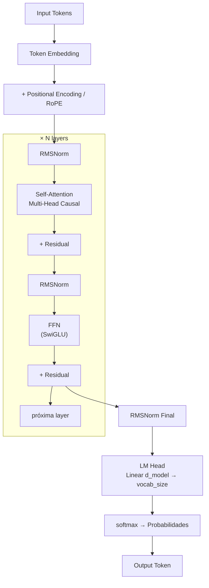

# Transformer Architecture

## Overview

O Transformer foi introduzido no paper seminal **"Attention Is All You Need"** (Vaswani et al., 2017 — arxiv:1706.03762) e representou uma ruptura fundamental na arquitetura de modelos de linguagem. Antes dele, o estado da arte para tarefas sequenciais era dominado por RNNs (Recurrent Neural Networks) e LSTMs (Long Short-Term Memory), que processam tokens um a um, sequencialmente.

**Por que o Transformer substituiu RNNs e LSTMs:**

- **Paralelização:** RNNs processam tokens sequencialmente — o estado no passo `t` depende do passo `t-1`. Isso impede paralelização durante o treino. O Transformer processa toda a sequência de uma vez via attention, tornando o treino massivamente paralelizável em GPUs/TPUs.
- **Long-range dependencies:** LSTMs tentam resolver o problema do gradiente que desvanece (vanishing gradient), mas ainda sofrem para capturar dependências entre tokens distantes. O mecanismo de self-attention acessa qualquer posição da sequência em O(1) passos.
- **Escalabilidade:** A arquitetura Transformer escala melhor com mais dados e parâmetros — empiricamente validado pelas leis de escala (Kaplan et al., 2020).

**Três famílias de arquitetura Transformer:**

| Família | Atenção | Treinamento | Exemplos |
|---------|---------|-------------|---------|
| **Decoder-only** | Causal (unidirecional) | Next-token prediction | GPT-4, Claude, Llama 3, Mistral, Falcon |
| **Encoder-Decoder** | Bidirecional + cross-attention | Seq2seq (reconstituição) | T5, BART, mT5, MarianMT |
| **Encoder-only** | Bidirecional | Masked Language Modeling | BERT, RoBERTa, DeBERTa |

> [!info] Por que Decoder-only domina LLMs
> A família decoder-only (GPT, Claude, Llama) dominou os grandes modelos de linguagem pois next-token prediction é uma tarefa de treinamento simples, escalável e que emerge em capacidades de raciocínio, tradução, sumarização e código sem necessidade de objetivos especializados. Um único modelo treinado assim é capaz de fazer o que encoder-decoder fazia com modelos específicos por tarefa.

---

## Como Funciona

### Self-Attention

O mecanismo central do Transformer é o **scaled dot-product attention**. Dado uma sequência de entrada, cada token produz três vetores:

- **Q (Query):** "O que estou procurando?" — representa a pergunta do token atual
- **K (Key):** "O que eu ofereço?" — representa o conteúdo que cada token anuncia
- **V (Value):** "O que eu entrego se selecionado?" — o conteúdo real a ser agregado

A fórmula completa:

```
Attention(Q, K, V) = softmax(QK^T / sqrt(d_k)) * V
```

**Explicação passo a passo:**

1. `QK^T` — produto interno entre Queries e Keys. Gera uma matriz `(seq_len × seq_len)` de scores de compatibilidade. Score alto = tokens semanticamente relacionados.
2. `/ sqrt(d_k)` — divisão pelo desvio padrão teórico do produto interno. Sem isso, para grandes valores de `d_k`, os produtos internos crescem em magnitude e o softmax satura em regiões de gradiente quase zero, dificultando o treino. `d_k` é a dimensão das chaves.
3. `softmax(...)` — normaliza os scores em distribuição de probabilidade. Cada linha soma 1. Isso define quanta atenção cada token dá a cada outro.
4. `* V` — média ponderada dos Values pelos pesos de atenção. O resultado é uma representação do token enriquecida pelo contexto da sequência.

**Complexidade:** O(n² · d), onde n é o comprimento da sequência e d é a dimensão do modelo. A matriz `QK^T` é n×n — este é o gargalo que motiva variantes eficientes como Flash Attention e Sparse Attention.

> [!warning] Causal Masking em Decoder-only
> Em modelos decoder-only (GPT, Claude, Llama), a atenção é **causal** — o token na posição `i` só pode atender a tokens em posições `≤ i`. Isso é implementado zerando (com `-inf` antes do softmax) a parte superior triangular da matriz de scores. Sem esse mascaramento, o modelo "veria o futuro" durante o treino.

### Multi-Head Attention

Em vez de aplicar um único mecanismo de atenção, o Multi-Head Attention projeta Q, K, V em `h` subespaços diferentes, calcula atenção em paralelo em cada um (chamados "heads"), e concatena os resultados:

```
MultiHead(Q, K, V) = Concat(head_1, ..., head_h) * W^O
head_i = Attention(Q * W_i^Q, K * W_i^K, V * W_i^V)
```

Onde:
- `W_i^Q ∈ R^(d_model × d_k)`, `W_i^K ∈ R^(d_model × d_k)`, `W_i^V ∈ R^(d_model × d_v)` são matrizes de projeção aprendidas por head
- `W^O ∈ R^(h·d_v × d_model)` é a projeção de saída
- Tipicamente `d_k = d_v = d_model / h`

**Por que múltiplas heads?** Cada head aprende a prestar atenção em diferentes aspectos da sequência simultaneamente:
- Uma head pode capturar relações sintáticas (sujeito-verbo)
- Outra pode capturar correferência (pronome → entidade referida)
- Outra pode capturar proximidade posicional
- Outra pode capturar relações semânticas de longo alcance

A concatenação e projeção final combina todas essas perspectivas. Em GPT-3, há 96 heads com `d_model = 12288`. Em Llama 3 70B, há 64 heads.

> [!tip] Grouped-Query Attention (GQA)
> Modelos modernos como Llama 3, Mistral e Gemma usam **Grouped-Query Attention (GQA)**, onde múltiplas query heads compartilham um único par K/V. Isso reduz drasticamente o tamanho do [[kv-cache-attention]] em inferência sem perda significativa de qualidade. GQA é um meio-termo entre Multi-Head Attention (MHA) e Multi-Query Attention (MQA).

### Positional Encoding

O mecanismo de self-attention é **invariante à permutação** — sem informação posicional, "o gato comeu o rato" e "o rato comeu o gato" seriam representações idênticas. O Positional Encoding injeta informação de posição nos embeddings.

**Variante 1: Sinusoidal (Vaswani et al., 2017)**

Adicionado diretamente ao embedding de entrada:

```
PE(pos, 2i)   = sin(pos / 10000^(2i / d_model))
PE(pos, 2i+1) = cos(pos / 10000^(2i / d_model))
```

Onde `pos` é a posição do token e `i` é a dimensão. Cada dimensão usa uma frequência diferente — dimensões baixas usam frequências altas (variam rapidamente com a posição), dimensões altas usam frequências baixas (variam lentamente).

**Por que funciona:** A posição relativa entre dois tokens pode ser expressa como uma transformação linear do PE absoluto. Isso permite ao modelo aprender a identificar "token B está 5 posições à frente de token A" a partir da diferença entre seus PEs.

**Limitação:** Degrada para sequências mais longas que as vistas no treinamento — não extrapola bem.

---

**Variante 2: RoPE — Rotary Positional Embedding (Su et al., 2021)**

Usado em: Llama, Mistral, GPT-NeoX, Falcon, Qwen, Gemma.

Em vez de adicionar PE ao embedding, RoPE **rotaciona** os vetores Q e K no espaço complexo por um ângulo proporcional à posição:

```
RoPE(x, pos) = x * e^(i * pos * θ)
```

Para vetores reais, isso equivale a aplicar uma matriz de rotação 2D a pares de dimensões, usando frequências:

```
θ_i = 1 / (base^(2i / d_head))   onde base = 10000 (padrão)
```

**Vantagens sobre sinusoidal:**
- O produto interno `Q_m · K_n` depende apenas da **diferença relativa** `(m - n)` de posições — propriedade de decaimento natural com distância
- Extrapola melhor para comprimentos maiores que os do treino (especialmente com YaRN ou Llama 3's RoPE scaling)
- Sem parâmetros extras — sem overhead de embedding

---

**Variante 3: ALiBi — Attention with Linear Biases (Press et al., 2021)**

Usado em: MPT, Falcon (algumas versões), BLOOM.

ALiBi não modifica os embeddings. Em vez disso, **subtrai um bias linear** dos scores de atenção antes do softmax:

```
score(i, j) = Q_i · K_j / sqrt(d_k) - m * |i - j|
```

Onde `m` é uma constante específica por head (geometricamente espaçada entre heads), e `|i - j|` é a distância relativa entre tokens.

**Vantagens:**
- Sem parâmetros treináveis — o bias é determinístico
- Excelente extrapolação para comprimentos além do treinamento (melhor que sinusoidal, comparável a RoPE)
- Impõe um prior explícito de que tokens próximos são mais relevantes

**Desvantagem:** Força decaimento monotônico com distância, o que pode ser subótimo para tarefas onde tokens distantes são altamente relevantes.

---

### Feed-Forward Network (FFN)

Após a camada de atenção, cada posição passa independentemente por uma rede feed-forward (sem interação entre posições):

**Clássico com ReLU (Vaswani et al., 2017):**

```
FFN(x) = max(0, x * W_1 + b_1) * W_2 + b_2
```

- Expande de `d_model` para `4 × d_model` (W_1), aplica ReLU, projeta de volta (W_2)
- A expansão 4× cria "memória" distribuída na FFN — empiricamente funciona bem

**SwiGLU (Noam Shazeer, 2020 — usado em Llama 2, Llama 3, PaLM, Gemini):**

```
SwiGLU(x, W, V) = Swish(x * W) ⊗ (x * V)

onde Swish(x) = x * σ(x)   [σ = sigmoid]
```

O mecanismo GLU (Gated Linear Unit) multiplica element-wise a ativação pela saída de um "gate" linear. Swish como função de gate produz gradientes suaves e não tem regiões com gradiente zero (ao contrário de ReLU).

**Por que SwiGLU é superior empiricamente:**
- Gradientes mais suaves facilitam otimização
- O mecanismo de gate permite à FFN selecionar quais features ativar condicionalmente
- Requer 3 matrizes de projeção em vez de 2 — para parâmetros equivalentes, usa expansão de `8/3 × d_model` em vez de `4×`

**Comparativo de ativações:**

| Ativação | Fórmula | Gradiente em x=0 | Usado em |
|----------|---------|------------------|---------|
| ReLU | `max(0, x)` | Indefinido (descontinuidade) | BERT, GPT-2 |
| GELU | `x * Φ(x)` | Suave | GPT-3, GPT-J |
| SwiGLU | `Swish(xW) ⊗ (xV)` | Suave + gate | Llama, PaLM, Gemini |

---

### Normalização

A normalização é aplicada para estabilizar o treinamento de redes profundas (modelos têm 32–96+ layers).

**LayerNorm (Ba et al., 2016 — usado em BERT, GPT-2):**

```
LayerNorm(x) = (x - μ) / (σ + ε) * γ + β
```

Onde:
- `μ` = média de `x` sobre as features (dimensão d_model)
- `σ` = desvio padrão de `x` sobre as features
- `γ, β` = parâmetros treináveis de escala e shift (por feature)
- `ε = 1e-5` — constante de estabilidade numérica

**RMSNorm (Zhang & Sennrich, 2019 — usado em Llama, PaLM, T5):**

```
RMSNorm(x) = x / RMS(x) * γ

onde RMS(x) = sqrt(mean(x²) + ε)
```

**Diferenças:**
- Remove o cálculo da média (centering) — hipótese: a invariância de escala é o que importa, não a invariância de translação
- Sem parâmetro `β` — menos parâmetros
- Empiricamente: mesma performance que LayerNorm, mais simples e ~10% mais rápido computacionalmente

**Pre-norm vs Post-norm:**

- **Post-norm (Vaswani 2017 original):** `x = LayerNorm(x + Sublayer(x))` — normalização aplicada **após** a operação e a conexão residual. Mais difícil de treinar em redes profundas; gradientes podem explodir nas primeiras etapas.
- **Pre-norm (GPT-3, Llama, etc.):** `x = x + Sublayer(LayerNorm(x))` — normalização aplicada **antes** da operação, sobre a conexão residual. Mais estável para redes muito profundas; virou o padrão em LLMs modernos.

> [!info] Por que Pre-norm é o padrão moderno
> Com Post-norm, o gradiente durante backpropagation deve atravessar a operação de normalização, o que pode causar instabilidade em redes com muitas camadas. Com Pre-norm, a conexão residual `x + ...` garante um caminho de gradiente direto do output até o input, similar ao ResNet. Isso permite treinar modelos com 80–100+ layers de forma estável.

---

### Diagrama do Transformer Block (Decoder-only)



**Fluxo detalhado por layer:**
1. `x_norm = RMSNorm(x)` — normaliza a entrada
2. `attn_out = MultiHeadSelfAttention(x_norm)` — computa atenção causal
3. `x = x + attn_out` — conexão residual (primeiro bloco)
4. `x_norm2 = RMSNorm(x)` — normaliza para o FFN
5. `ffn_out = SwiGLU_FFN(x_norm2)` — rede feed-forward
6. `x = x + ffn_out` — conexão residual (segundo bloco)
7. Repetir N vezes (Llama 3 8B: N=32; Llama 3 70B: N=80; GPT-4: ~120 estimado)

---

## Implementação Prática

### Scaled Dot-Product Attention em PyTorch

```python
import torch
import torch.nn as nn
import torch.nn.functional as F
import math


def scaled_dot_product_attention(
    q: torch.Tensor,
    k: torch.Tensor,
    v: torch.Tensor,
    mask: torch.Tensor | None = None,
    dropout_p: float = 0.0,
) -> tuple[torch.Tensor, torch.Tensor]:
    """
    Scaled dot-product attention.

    Args:
        q: Query tensor, shape (batch, heads, seq_len_q, d_k)
        k: Key tensor,   shape (batch, heads, seq_len_k, d_k)
        v: Value tensor, shape (batch, heads, seq_len_k, d_v)
        mask: Optional boolean mask — True onde deve ser mascarado (ignorado)
              shape (batch, 1, seq_len_q, seq_len_k) ou (1, 1, seq_len_q, seq_len_k)
        dropout_p: Taxa de dropout nos pesos de atenção

    Returns:
        output: Tensor (batch, heads, seq_len_q, d_v)
        attn_weights: Tensor (batch, heads, seq_len_q, seq_len_k) — pesos de atenção
    """
    d_k = q.size(-1)

    # Compute attention scores: (batch, heads, seq_q, seq_k)
    scores = torch.matmul(q, k.transpose(-2, -1)) / math.sqrt(d_k)

    # Apply causal mask (upper triangular = -inf)
    if mask is not None:
        scores = scores.masked_fill(mask, float('-inf'))

    # Softmax over key dimension
    attn_weights = F.softmax(scores, dim=-1)

    # Dropout on attention weights (regularization durante treino)
    if dropout_p > 0.0:
        attn_weights = F.dropout(attn_weights, p=dropout_p)

    # Weighted sum of values
    output = torch.matmul(attn_weights, v)

    return output, attn_weights


def make_causal_mask(seq_len: int, device: torch.device) -> torch.Tensor:
    """
    Cria máscara causal triangular superior para decoder-only.
    Retorna tensor bool (1, 1, seq_len, seq_len) onde True = mascarado.
    """
    mask = torch.triu(torch.ones(seq_len, seq_len, device=device), diagonal=1)
    return mask.bool().unsqueeze(0).unsqueeze(0)


# Exemplo de uso
if __name__ == "__main__":
    batch_size, n_heads, seq_len, d_k = 2, 8, 16, 64

    q = torch.randn(batch_size, n_heads, seq_len, d_k)
    k = torch.randn(batch_size, n_heads, seq_len, d_k)
    v = torch.randn(batch_size, n_heads, seq_len, d_k)

    causal_mask = make_causal_mask(seq_len, device=q.device)

    output, weights = scaled_dot_product_attention(q, k, v, mask=causal_mask)
    print(f"Output shape: {output.shape}")   # (2, 8, 16, 64)
    print(f"Weights shape: {weights.shape}") # (2, 8, 16, 16)
    # Verificar causalidade: weights[:, :, 0, 1:] deve ser ~0
    print(f"Future tokens masked: {weights[0, 0, 0, 1:].sum().item():.6f}")
```

---

### Multi-Head Attention em PyTorch

```python
import torch
import torch.nn as nn
import torch.nn.functional as F
import math


class MultiHeadAttention(nn.Module):
    """
    Multi-Head Self-Attention conforme Vaswani et al. (2017).

    Implementação educacional — produção usaria Flash Attention
    via torch.nn.functional.scaled_dot_product_attention com
    is_causal=True para eficiência de memória.
    """

    def __init__(
        self,
        d_model: int,
        n_heads: int,
        dropout: float = 0.1,
        causal: bool = True,
    ):
        super().__init__()
        assert d_model % n_heads == 0, "d_model deve ser divisível por n_heads"

        self.d_model = d_model
        self.n_heads = n_heads
        self.d_k = d_model // n_heads  # dimensão por head
        self.causal = causal

        # Projeções lineares para Q, K, V e output
        self.W_q = nn.Linear(d_model, d_model, bias=False)
        self.W_k = nn.Linear(d_model, d_model, bias=False)
        self.W_v = nn.Linear(d_model, d_model, bias=False)
        self.W_o = nn.Linear(d_model, d_model, bias=False)

        self.dropout = nn.Dropout(dropout)
        self.scale = math.sqrt(self.d_k)

    def forward(
        self,
        x: torch.Tensor,
        kv: torch.Tensor | None = None,
    ) -> torch.Tensor:
        """
        Args:
            x:  (batch, seq_len, d_model) — tokens de entrada
            kv: (batch, seq_len_kv, d_model) — para cross-attention (encoder-decoder).
                Se None, usa self-attention (x → Q, K, V)

        Returns:
            output: (batch, seq_len, d_model)
        """
        B, T, _ = x.shape
        kv_src = kv if kv is not None else x

        # Projetar Q, K, V: (B, T, d_model) → (B, n_heads, T, d_k)
        q = self.W_q(x).view(B, T, self.n_heads, self.d_k).transpose(1, 2)
        k = self.W_k(kv_src).view(B, -1, self.n_heads, self.d_k).transpose(1, 2)
        v = self.W_v(kv_src).view(B, -1, self.n_heads, self.d_k).transpose(1, 2)

        # Scores de atenção
        scores = torch.matmul(q, k.transpose(-2, -1)) / self.scale

        # Causal masking
        if self.causal and kv is None:
            mask = torch.triu(
                torch.ones(T, T, device=x.device, dtype=torch.bool),
                diagonal=1
            )
            scores = scores.masked_fill(mask.unsqueeze(0).unsqueeze(0), float('-inf'))

        # Softmax + dropout
        attn = F.softmax(scores, dim=-1)
        attn = self.dropout(attn)

        # Weighted values: (B, n_heads, T, d_k)
        out = torch.matmul(attn, v)

        # Reshape: (B, n_heads, T, d_k) → (B, T, d_model)
        out = out.transpose(1, 2).contiguous().view(B, T, self.d_model)

        # Projeção de saída
        return self.W_o(out)


# Teste da implementação
if __name__ == "__main__":
    d_model = 512
    n_heads = 8
    batch_size = 4
    seq_len = 32

    mha = MultiHeadAttention(d_model=d_model, n_heads=n_heads, dropout=0.0)
    x = torch.randn(batch_size, seq_len, d_model)

    output = mha(x)
    print(f"Input:  {x.shape}")      # (4, 32, 512)
    print(f"Output: {output.shape}") # (4, 32, 512)

    # Contar parâmetros
    params = sum(p.numel() for p in mha.parameters())
    print(f"Parâmetros: {params:,}")  # 4 * (512*512) = 1,048,576
```

---

### Inspecionando Pesos de Atenção com HuggingFace Transformers

```python
from transformers import AutoTokenizer, AutoModel
import torch
import matplotlib.pyplot as plt
import numpy as np


def inspect_attention_weights(
    model_name: str = "bert-base-uncased",
    text: str = "The cat sat on the mat because it was tired.",
    layer: int = 8,
    head: int = 0,
) -> None:
    """
    Carrega um modelo HuggingFace e visualiza os pesos de atenção
    de uma layer e head específicas.

    Nota: output_attentions=True retorna todos os pesos de atenção.
    Para modelos grandes, isso usa memória extra — use com cautela.
    """
    tokenizer = AutoTokenizer.from_pretrained(model_name)
    model = AutoModel.from_pretrained(model_name, output_attentions=True)
    model.eval()

    # Tokenizar input
    inputs = tokenizer(text, return_tensors="pt")
    tokens = tokenizer.convert_ids_to_tokens(inputs["input_ids"][0])

    print(f"Tokens ({len(tokens)}): {tokens}")

    with torch.no_grad():
        outputs = model(**inputs)

    # outputs.attentions: tuple de (n_layers,) tensores
    # Cada tensor: (batch, n_heads, seq_len, seq_len)
    attentions = outputs.attentions

    print(f"\nNúmero de layers: {len(attentions)}")
    print(f"Shape por layer:  {attentions[0].shape}")
    # Ex BERT: (1, 12, 12, 12) — (batch, heads, seq, seq)

    # Extrair atenção da layer e head especificadas
    attn_matrix = attentions[layer][0, head].numpy()  # (seq_len, seq_len)

    # Visualizar como heatmap
    fig, ax = plt.subplots(figsize=(10, 8))
    im = ax.imshow(attn_matrix, cmap='Blues', vmin=0, vmax=attn_matrix.max())

    ax.set_xticks(range(len(tokens)))
    ax.set_yticks(range(len(tokens)))
    ax.set_xticklabels(tokens, rotation=45, ha='right', fontsize=9)
    ax.set_yticklabels(tokens, fontsize=9)

    ax.set_title(f"Attention Weights — Layer {layer}, Head {head}", fontsize=12)
    plt.colorbar(im, ax=ax)
    plt.tight_layout()
    plt.savefig("attention_heatmap.png", dpi=150)
    print(f"\nHeatmap salvo em attention_heatmap.png")

    # Análise: quais tokens recebem mais atenção do token [CLS]?
    cls_attn = attn_matrix[0]  # atenção do [CLS] para todos
    top_k = 3
    top_indices = cls_attn.argsort()[-top_k:][::-1]
    print(f"\nTokens que [CLS] mais atende (layer {layer}, head {head}):")
    for idx in top_indices:
        print(f"  '{tokens[idx]}' — peso: {cls_attn[idx]:.4f}")


# Para modelos decoder-only com HuggingFace:
def inspect_decoder_attention(
    model_name: str = "gpt2",
    prompt: str = "The transformer architecture was introduced in",
) -> None:
    """
    Inspeciona atenção em modelo decoder-only (GPT-2 como exemplo leve).
    """
    from transformers import AutoTokenizer, AutoModelForCausalLM

    tokenizer = AutoTokenizer.from_pretrained(model_name)
    model = AutoModelForCausalLM.from_pretrained(
        model_name,
        output_attentions=True,
        attn_implementation="eager"  # necessário para output_attentions em GPT-2
    )
    model.eval()

    inputs = tokenizer(prompt, return_tensors="pt")
    tokens = tokenizer.convert_ids_to_tokens(inputs["input_ids"][0])

    with torch.no_grad():
        outputs = model(**inputs)

    attentions = outputs.attentions
    print(f"Modelo: {model_name}")
    print(f"Tokens: {tokens}")
    print(f"Layers: {len(attentions)}, Heads: {attentions[0].shape[1]}")
    print(f"Shape: {attentions[0].shape}")


if __name__ == "__main__":
    # BERT (encoder-only) — atenção bidirecional
    inspect_attention_weights(
        model_name="bert-base-uncased",
        text="The cat sat on the mat because it was tired.",
        layer=8,
        head=0,
    )

    # GPT-2 (decoder-only) — atenção causal
    inspect_decoder_attention(
        model_name="gpt2",
        prompt="The transformer architecture was introduced in",
    )
```

> [!tip] Flash Attention em Produção
> Para inferência e treinamento eficientes, use `torch.nn.functional.scaled_dot_product_attention` com `is_causal=True` — ele seleciona automaticamente Flash Attention quando disponível, usando O(n) memória em vez de O(n²). A API HuggingFace expõe isso via `attn_implementation="flash_attention_2"` no `from_pretrained()`.

---

## Comparativos

### Decoder-only vs Encoder-Decoder vs Encoder-only

| Aspecto | Decoder-only | Encoder-Decoder | Encoder-only |
|---------|--------------|-----------------|--------------|
| **Exemplos de modelos** | GPT-4, Claude 3, Llama 3, Mistral, Falcon | T5, BART, mT5, MarianMT | BERT, RoBERTa, DeBERTa |
| **Treinamento** | Next-token prediction | Seq2seq (reconstituição masked + autoregressive) | Masked Language Modeling (15% tokens) |
| **Uso principal** | Geração de texto, raciocínio, code, chat | Tradução, sumarização, QA extrativa | Classificação, NER, embeddings de texto |
| **Tipo de atenção** | Causal (triangular inferior) — unidirecional | Encoder: bidirecional; Decoder: causal + cross-attention | Bidirecional completa |
| **Vantagem** | Um modelo, múltiplas tarefas; escala bem | Eficiente para tarefas condicionadas; representação separada | Representações ricas; melhor para entendimento |
| **Desvantagem** | Atenção causal limita representação; caro para classificação | Dois módulos para manter; complexidade de cross-attention | Não gera texto naturalmente |
| **Tamanho típico** | 7B–1T+ parâmetros | 250M–11B | 110M–1.5B |
| **KV Cache** | Fundamental para inferência eficiente | Apenas no decoder | Não aplicável |

### Comparativo de Positional Encodings

| Método | Parâmetros | Extrapolação | Usado em | Mecanismo |
|--------|-----------|--------------|---------|----------|
| Sinusoidal | 0 | Ruim | BERT, GPT-2 original | Adicionado ao embedding |
| Aprendido (Absolute) | d_model × max_seq | Ruim | GPT-3 | Embedding lookup por posição |
| RoPE | 0 | Boa (com scaling) | Llama, Mistral, Gemma | Rotação de Q e K |
| ALiBi | 0 | Excelente | MPT, Falcon | Bias linear nos scores |
| YaRN (extensão RoPE) | 0 | Excelente | Llama 3 long context | RoPE com interpolação não-uniforme |

### Flash Attention vs Attention Padrão

| Aspecto | Attention Padrão | Flash Attention v2 |
|---------|-----------------|---------------------|
| **Complexidade de tempo** | O(n²·d) | O(n²·d) — mesma, só mais rápido na prática |
| **Complexidade de memória** | O(n²) | O(n) — não materializa a matriz de atenção completa |
| **Velocidade (prática)** | 1× (baseline) | 2–4× mais rápido em A100 |
| **Equivalência numérica** | Referência | Pequenas diferenças de ponto flutuante |
| **Disponibilidade** | Sempre | Requer CUDA + hardware compatível |

---

## Gotchas

> [!warning] Attention Sink
> O token `<bos>` (beginning-of-sequence) absorve atenção desproporcionalmente em modelos treinados com causal attention — especialmente nas primeiras e últimas layers. Isso faz sentido matematicamente: em causal masking, todos os tokens podem atender ao `<bos>` sem revelar informação futura, tornando-o um "dreno" seguro para atenção que não encontra alvo relevante. Isso afeta a interpretabilidade de mapas de atenção e é parte da motivação para Streaming LLM (Xiao et al., 2023), que mantém o `<bos>` no KV cache mesmo com janelas deslizantes.

> [!warning] Flash Attention e Equivalência Numérica
> Flash Attention não é matematicamente idêntico ao attention padrão — há pequenas diferenças de ponto flutuante resultantes da recomputação em blocos (tiling) para economizar memória. Em produção, resultados podem diferir levemente entre implementações. Mantenha consistência: use a mesma implementação (`flash_attention_2` ou `eager`) em treino e inferência. Inconsistência pode causar degradação sutil de performance que é difícil de diagnosticar.

> [!warning] Positional Encoding e Out-of-Distribution
> Modelos com PE sinusoidal ou aprendido absoluto degradam significativamente para sequências mais longas que o comprimento máximo de treino. RoPE extrapola melhor, mas ainda tem limite prático — modelos Llama treinados com 4K de contexto sem YaRN não são confiáveis em 8K+. ALiBi é o mais robusto para extrapolação por design. Verifique o `max_position_embeddings` no `config.json` do modelo e não exceda sem técnicas de extensão de contexto validadas (YaRN, LongRoPE, etc.).

> [!warning] Atenção Causal e Bidirectional Mismatch
> Não use um modelo decoder-only (ex: Llama) como encoder para embeddings de texto sem modificação. A atenção causal faz com que representações de tokens anteriores não vejam tokens futuros — o embedding do último token captura "tudo que veio antes", mas o embedding do primeiro token só se vê. Para embeddings, use BERT/RoBERTa (bidirecional) ou [[fine-tuning-peft]] de modelos decoder-only com atenção bidirecional habilitada (ex: E5-Mistral).

> [!tip] d_model e d_k: Regras de Ouro
> Na prática, `d_k = d_model / n_heads` é universalmente adotado. Para Llama 3 8B: `d_model=4096`, `n_heads=32`, `d_k=128`. O escalonamento `1/sqrt(d_k)` é crítico — sem ele, com `d_k=128`, os produtos internos têm desvio padrão ≈ 11.3, e o softmax satura causando gradientes quase nulos. Com escalonamento, o desvio padrão volta a ~1.

---

## Snippets

### Implementação de RMSNorm

```python
import torch
import torch.nn as nn


class RMSNorm(nn.Module):
    """
    Root Mean Square Layer Normalization (Zhang & Sennrich, 2019).
    Usado em Llama, PaLM, T5, Gemma.

    Mais simples que LayerNorm: sem centering (sem subtração da média)
    e sem parâmetro beta (bias).
    """

    def __init__(self, dim: int, eps: float = 1e-6):
        super().__init__()
        self.eps = eps
        self.weight = nn.Parameter(torch.ones(dim))  # escala γ

    def forward(self, x: torch.Tensor) -> torch.Tensor:
        # RMS: sqrt(mean(x²)) por feature
        rms = torch.sqrt(x.pow(2).mean(dim=-1, keepdim=True) + self.eps)
        return (x / rms) * self.weight
```

### Implementação de SwiGLU FFN

```python
import torch
import torch.nn as nn
import torch.nn.functional as F


class SwiGLUFFN(nn.Module):
    """
    Feed-Forward Network com ativação SwiGLU (Shazeer, 2020).
    Usado em Llama 2/3, PaLM, Gemini.

    Usa 3 projeções lineares em vez de 2.
    Para parâmetro-equivalência com FFN 4× usando ReLU,
    o fator de expansão é tipicamente 8/3 (arredondado).
    """

    def __init__(self, d_model: int, expansion_factor: float = 8 / 3):
        super().__init__()
        # Garantir que d_ff seja múltiplo de 64 para eficiência em hardware
        d_ff = int(d_model * expansion_factor)
        d_ff = (d_ff + 63) // 64 * 64

        self.gate_proj = nn.Linear(d_model, d_ff, bias=False)  # W (gate)
        self.up_proj   = nn.Linear(d_model, d_ff, bias=False)  # V
        self.down_proj = nn.Linear(d_ff, d_model, bias=False)  # W_2

    def forward(self, x: torch.Tensor) -> torch.Tensor:
        # Swish(xW) ⊗ (xV)
        gate = F.silu(self.gate_proj(x))   # SiLU = Swish
        up   = self.up_proj(x)
        return self.down_proj(gate * up)


# Verificação de parâmetros comparada a ReLU FFN
if __name__ == "__main__":
    d_model = 4096  # Llama 3 8B

    # FFN clássico com ReLU (4× expansão)
    relu_ffn_params = 2 * d_model * (4 * d_model)  # W_1 + W_2
    print(f"ReLU FFN parâmetros:   {relu_ffn_params:,}")  # 33,554,432

    # SwiGLU FFN (8/3 × expansão)
    d_ff_swiglu = int(d_model * 8 / 3)
    swiglu_params = 3 * d_model * d_ff_swiglu  # W_gate + W_up + W_down
    print(f"SwiGLU FFN parâmetros: {swiglu_params:,}")  # ~33,488,896 ≈ equivalente
```

### Verificação de Causalidade da Máscara de Atenção

```python
import torch


def verify_causal_masking(seq_len: int = 5) -> None:
    """
    Demonstra como a máscara causal impede acesso a tokens futuros.
    Útil para debugging de implementações de atenção.
    """
    # Máscara causal: True onde deve ser ignorado (triangular superior)
    mask = torch.triu(torch.ones(seq_len, seq_len, dtype=torch.bool), diagonal=1)

    print("Máscara causal (True = mascarado = futuro):")
    print(mask.int())
    # [[0, 1, 1, 1, 1],
    #  [0, 0, 1, 1, 1],
    #  [0, 0, 0, 1, 1],
    #  [0, 0, 0, 0, 1],
    #  [0, 0, 0, 0, 0]]

    # Aplicar -inf onde mascarado e verificar softmax
    scores = torch.zeros(seq_len, seq_len)
    scores = scores.masked_fill(mask, float('-inf'))
    attn_weights = torch.softmax(scores, dim=-1)

    print("\nPesos de atenção após softmax (cada linha soma 1):")
    print(attn_weights.round(decimals=3))
    # Token 0: só atende a si mesmo [1.0, 0, 0, 0, 0]
    # Token 4: atende a todos igualmente [0.2, 0.2, 0.2, 0.2, 0.2]


verify_causal_masking()
```

### Contagem de Parâmetros de um Transformer Block

```python
def count_transformer_params(
    d_model: int,
    n_heads: int,
    ffn_expansion: float = 8 / 3,
    use_bias: bool = False,
) -> dict:
    """
    Calcula parâmetros de um único Transformer block decoder-only
    com RMSNorm, Multi-Head Attention e SwiGLU FFN.
    """
    d_ff = int(d_model * ffn_expansion)

    # Attention: Q, K, V, O projections
    attn_params = 4 * d_model * d_model  # W_q, W_k, W_v, W_o

    # FFN SwiGLU: gate, up, down
    ffn_params = 3 * d_model * d_ff

    # RMSNorm: 2 × (apenas weight γ, sem bias)
    norm_params = 2 * d_model

    total = attn_params + ffn_params + norm_params

    return {
        "attention": attn_params,
        "ffn": ffn_params,
        "norm": norm_params,
        "total_per_block": total,
    }


# Llama 3 8B: d_model=4096, n_heads=32, n_layers=32
params = count_transformer_params(d_model=4096, n_heads=32)
print("Parâmetros por block (Llama 3 8B-like):")
for k, v in params.items():
    print(f"  {k}: {v:,}")

n_layers = 32
embedding_params = 128256 * 4096  # vocab_size × d_model
total_model = n_layers * params["total_per_block"] + embedding_params
print(f"\nTotal estimado (32 layers + embeddings): {total_model / 1e9:.2f}B params")
```

---

## References

- **Attention Is All You Need** — Vaswani, A. et al. (2017). Google Brain. [arxiv:1706.03762](https://arxiv.org/abs/1706.03762)
- **RoFormer: Enhanced Transformer with Rotary Position Embedding (RoPE)** — Su, J. et al. (2021). [arxiv:2104.09864](https://arxiv.org/abs/2104.09864)
- **GLU Variants Improve Transformer (SwiGLU)** — Noam Shazeer (2020). [arxiv:2002.05202](https://arxiv.org/abs/2002.05202)
- **FlashAttention: Fast and Memory-Efficient Exact Attention with IO-Awareness** — Dao, T. et al. (2022). [arxiv:2205.14135](https://arxiv.org/abs/2205.14135)
- **PaLM: Scaling Language Modeling with Pathways** — Chowdhery, A. et al. (2022). Google Research. [arxiv:2204.02311](https://arxiv.org/abs/2204.02311)
- **Train Short, Test Long: ALiBi** — Press, O. et al. (2021). [arxiv:2108.12409](https://arxiv.org/abs/2108.12409)
- **Root Mean Square Layer Normalization** — Zhang, B. & Sennrich, R. (2019). [arxiv:1910.07467](https://arxiv.org/abs/1910.07467)
- **Scaling Laws for Neural Language Models** — Kaplan, J. et al. (2020). OpenAI. [arxiv:2001.08361](https://arxiv.org/abs/2001.08361)
- **FlashAttention-2: Faster Attention with Better Parallelism** — Dao, T. (2023). [arxiv:2307.08691](https://arxiv.org/abs/2307.08691)

---

## Related

- [[kv-cache-attention]] — como o KV cache usa Q, K, V para inferência eficiente sem recomputar atenção para tokens anteriores
- [[gpu-architecture]] — por que Tensor Cores são otimizados para matrix multiply (GEMM) como QK^T, e como isso molda o design de transformers
- [[embeddings]] — representações vetoriais de tokens que entram na camada de atenção como input
- [[tokenization]] — o que são os tokens que entram no transformer e como texto é convertido em IDs
- [[pretraining]] — como o transformer é treinado com next-token prediction em escala (dados, compute, otimização)
- [[prompt-engineering]] — técnicas que se aproveitam da arquitetura de atenção para obter comportamentos específicos
- [[fine-tuning-peft]] — como adaptar os pesos do transformer para tarefas específicas com LoRA, QLoRA e outros métodos PEFT
